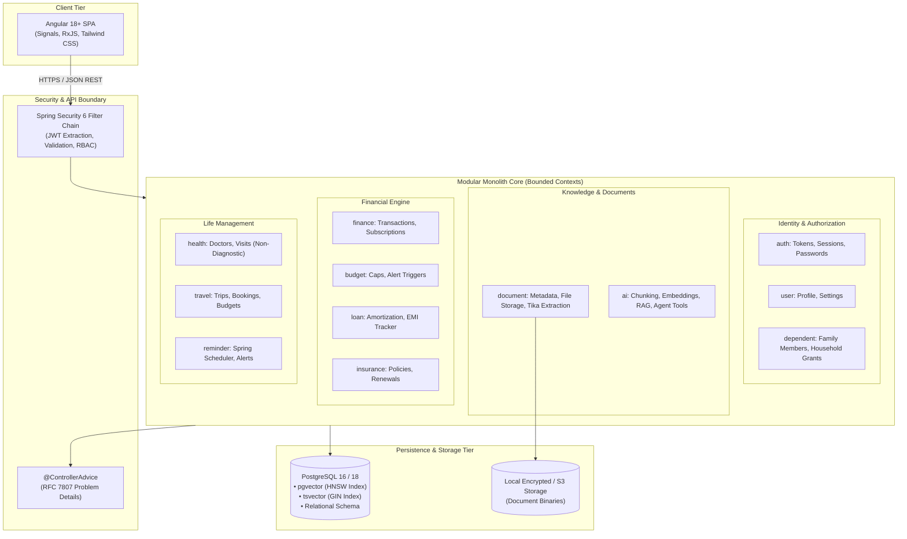
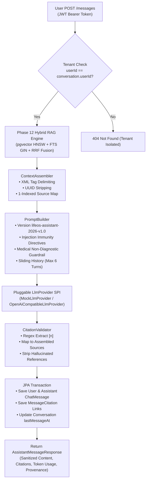
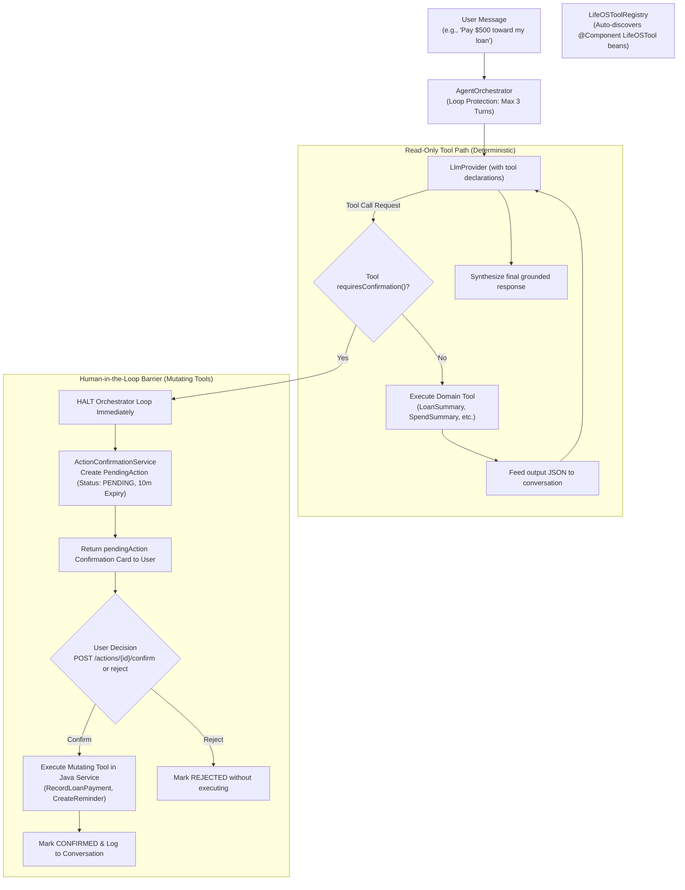

# LifeOS — System Architecture Specification

---

## 1. Architectural Strategy & Design Principles

LifeOS is architected as an **Extensible Modular Monolith** in **Java 21 LTS** and **Spring Boot 3.3.5**. 



### Core Tenets:
1. **High Cohesion, Low Coupling**: Each module represents an independent bounded context with its own entities, DTOs, services, and repositories.
2. **Strict Resource-Level Multi-Tenancy**: Data access is always scoped by `user_id`. No entity can be updated or read without matching ownership.
3. **Hybrid Data Access Pattern**:
   - **Spring Data JPA**: Utilized for standard OLTP transactions, domain entity validation, and parent-child persistence.
   - **Spring Data JDBC / NamedParameterJdbcTemplate**: Utilized for complex analytical queries (e.g., monthly spending summaries, threshold evaluations, raw vector distance queries).
4. **Provider-Agnostic AI Integration**: The AI subsystem defines pure Java interfaces (`LLMProvider`, `EmbeddingProvider`, `VectorStorePort`) to ensure zero lock-in to any single vendor.
5. **Anti-Hallucination & Determinism**: Natural language calculations (e.g., total monthly dues) are always executed via deterministic Java services, never guessed by the LLM.

---

## 2. Package & Directory Structure

```text
com.lifeos
├── common                      # Shared kernel across modules
│   ├── entity                  # BaseEntity (UUID, createdAt, updatedAt, isDeleted)
│   ├── dto                     # ApiResponse<T>, PageResponse<T>, ErrorResponse
│   ├── exception               # ResourceNotFoundException, UnauthorizedException
│   ├── security                # SecurityUtils, UserPrincipal
│   └── util                    # DateUtils, MoneyUtils
│
├── config                      # Central application configurations
│   ├── OpenApiConfig.java      # Swagger / OpenAPI documentation
│   ├── SecurityConfig.java     # Spring Security 6 filter chains & CORS
│   ├── StorageConfig.java      # Local / S3 document storage beans
│   └── AsyncSchedulerConfig    # Thread pools and task scheduling
│
├── auth                        # Authentication & Token Management
│   ├── controller              # AuthController (/api/v1/auth)
│   ├── service                 # AuthService, TokenService, PasswordService
│   ├── dto                     # LoginRequest, RegisterRequest, TokenResponse
│   └── entity                  # RefreshTokenEntity
│
├── user                        # User Profile & Preferences
│   ├── controller              # UserController (/api/v1/users)
│   ├── service                 # UserService
│   ├── repository              # UserRepository
│   └── entity                  # UserEntity, Role
│
├── dependent                   # Family & Household Management
│   ├── controller              # DependentController (/api/v1/dependents)
│   ├── service                 # DependentService
│   └── entity                  # DependentEntity, AccessGrantEntity
│
├── document                    # File Management, Ingestion & Text Extraction
│   ├── controller              # DocumentController (/api/v1/documents)
│   ├── service                 # DocumentService (Upload, Versioning, Two-Stage Deletion)
│   ├── storage                 # DocumentStorageService, LocalStorageService, StorageProperties
│   ├── extractor               # DocumentTextExtractor, TikaDocumentTextExtractor, ExtractionResult
│   ├── repository              # DocumentRepository
│   ├── dto                     # UploadDocumentRequest, DocumentResponse, DocumentDetailResponse
│   └── entity                  # DocumentEntity, DocumentCategory, DocumentType, IngestionStatus
│
├── finance                     # Income, Expenses, Subscriptions & Analytics
│   ├── controller              # TransactionController, RecurringTransactionController, FinanceAnalyticsController
│   ├── service                 # TransactionService, RecurringTransactionService, FinanceAnalyticsService
│   ├── repository              # TransactionRepository, RecurringTransactionRepository, FinanceAnalyticsJdbcRepository
│   ├── dto                     # Transaction & Recurring DTOs, MonthlySummaryResponse, MoM Analytics
│   └── entity                  # TransactionEntity, RecurringTransactionEntity, Enums (Categories, Methods)
│
├── budget                      # Monthly Budgets, Run-Rate Projections & Threshold Alerts
│   ├── controller              # BudgetController (/api/v1/budgets)
│   ├── service                 # BudgetService (Deterministic tracking, alerts, in-flight projections)
│   ├── repository              # BudgetRepository
│   ├── event                   # BudgetThresholdReachedEvent (Decoupled Spring Application Event)
│   ├── dto                     # Create/UpdateBudgetRequest, BudgetResponse, BudgetStatusResponse
│   └── entity                  # BudgetEntity (JSONB alert_thresholds)
│
├── loan                        # Loans, Prepayments, Mathematical Amortization Engine
│   ├── engine                  # LoanAmortizationEngine (Pure deterministic math, DECIMAL128, penny reconciliation)
│   ├── controller              # LoanController (/api/v1/loans)
│   ├── service                 # LoanService, LoanAnalyticsService
│   ├── repository              # LoanRepository, LoanPaymentRepository, LoanAnalyticsJdbcRepository
│   ├── dto                     # Create/UpdateLoanRequest, LoanResponse, RecordLoanPaymentRequest, AmortizationScheduleResponse
│   └── entity                  # LoanEntity, LoanPaymentEntity
│
├── insurance                   # Insurance Portfolio, Policy Renewals & Reminder Sync
│   ├── controller              # InsuranceController (/api/v1/insurance)
│   ├── service                 # InsuranceService (Tenant validation, renewal workflow, reminder sync)
│   ├── repository              # InsurancePolicyRepository
│   ├── dto                     # Create/UpdateInsuranceRequest, RenewPolicyRequest, InsuranceResponse, UpcomingRenewalsResponse
│   └── entity                  # InsurancePolicyEntity
│
├── reminder                    # Background Scheduling & Due Date Reminders
│   ├── repository              # ReminderRepository
│   └── entity                  # ReminderEntity, ReminderStatus
│
├── healthcare                  # Healthcare Appointments & Medical Document Organization (Non-Diagnostic)
│   ├── controller              # AppointmentController (/api/v1/healthcare/appointments), MedicalDocumentController (/documents)
│   ├── service                 # AppointmentService (Lifecycle, reschedule, reminder sync), MedicalDocumentService
│   ├── repository              # AppointmentRepository
│   ├── dto                     # Create/Update/Reschedule/Status Requests, AppointmentResponse, MedicalDocumentLinkResponse
│   └── entity                  # AppointmentEntity (health_appointments table), AppointmentStatus (SCHEDULED, COMPLETED, etc.)
│
├── travel                      # Trips, Bookings & Itineraries
│   ├── controller              # TravelController (/api/v1/travel)
│   ├── service                 # TripService, TripBudgetService, ItineraryService, TravelerService, TravelDocumentService
│   ├── repository              # TripRepository, ItineraryItemRepository, TravelerRepository
│   ├── dto                     # Trip, Itinerary, Traveler request & response DTOs, MultiCurrencySpendSummary
│   └── entity                  # TripEntity, ItineraryItemEntity, TravelerEntity
│
├── asset                       # Product Warranties, Invoices & Asset Management
│   ├── controller              # AssetController, InvoiceController, WarrantyController, WarrantyClaimController, AssetServiceRecordController, AssetDocumentController
│   ├── service                 # AssetService, InvoiceService, WarrantyService, WarrantyClaimService, AssetServiceRecordService, AssetDocumentService
│   ├── repository              # AssetRepository, InvoiceRepository, InvoiceItemRepository, WarrantyRepository, WarrantyClaimRepository, AssetServiceRecordRepository, AssetStatusHistoryRepository
│   ├── dto                     # Asset, Invoice, Warranty, Claim, Service Record DTOs & AcquisitionCostSummary
│   └── entity                  # AssetEntity, InvoiceEntity, InvoiceItemEntity, WarrantyEntity, WarrantyClaimEntity, AssetServiceRecordEntity, AssetStatusHistoryEntity
│
├── reminder                    # Background Scheduling & Due Date Scanners
│   ├── service                 # ReminderSchedulerService, NotificationDispatcher
│   ├── repository              # ReminderRepository
│   └── entity                  # ReminderEntity, NotificationEntity
│
├── search                      # Unified Search & Advanced Query Platform
│   ├── controller              # SearchController (/api/v1/search, /count, /suggest, /entities)
│   ├── service                 # UnifiedSearchService (Enforces tenant isolation, validates boundaries)
│   ├── engine                  # SearchEngine port, PostgresLexicalSearchEngine (tsvector, GIN, websearch_to_tsquery)
│   └── dto                     # SearchQuery, SearchResultItemDto, SearchCountSummaryDto, SearchSuggestionDto
│
├── rag                         # Document Intelligence & Hybrid Retrieval
│   └── retrieval               # Phase 12 Hybrid RAG Retrieval Engine
│       ├── controller          # RetrievalController (POST /api/v1/search/retrieve)
│       ├── service             # RetrievalService, HybridRetrievalService
│       ├── repository          # JdbcRetrievalRepository (pgvector HNSW & FTS GIN pushdown queries)
│       ├── fusion              # CandidateFusionEngine (Reciprocal Rank Fusion k=60)
│       ├── rerank              # Reranker, DeterministicCrossSignalReranker
│       ├── citation            # CitationGenerator (Provenance footnotes)
│       ├── processor           # QueryProcessor (Sanitization, length clamping, phrase/id extraction)
│       ├── config              # RetrievalProperties
│       └── dto                 # RetrievalRequest, RetrievalResponse, RetrievedChunkDto, RetrievalCitationDto
│
└── ai                          # AI & Grounded Assistant (Phase 13)
    ├── controller              # AssistantController (/api/v1/assistant/conversations, /messages)
    ├── service                 # AssistantService, DefaultAssistantService, ConversationService
    ├── conversation            # Multi-Tenant Conversation Sessions
    │   ├── entity              # Conversation, ChatMessage, MessageCitation, MessageRole
    │   └── repository          # ConversationRepository, ChatMessageRepository, MessageCitationRepository
    ├── llm                     # Pluggable LLM Provider SPI & Adapters
    │   ├── LlmProvider         # Provider SPI (getProviderName, getModelName, generate)
    │   ├── MockLlmProvider     # Offline deterministic provider for unit/integration/CI tests
    │   ├── OpenAiCompatibleLlmProvider # Remote OpenAI/Azure/Ollama/vLLM HTTP client
    │   ├── LlmRequest          # Multi-role prompt request with temperature, maxTokens
    │   ├── LlmResponse         # Model completion with token usage & latency
    │   ├── LlmProperties       # Configuration properties (timeout, retries, model, endpoint)
    │   └── LlmException        # Typed AI provider failure with retryable classification
    ├── grounding               # Grounding & Verification Engine
    │   ├── ContextAssembler    # XML delimiter formatting (<untrusted_document_source>), UUID stripping
    │   ├── PromptBuilder       # Versioned prompt (lifeos-assistant-2026-v1.0), safety constraints
    │   └── CitationValidator   # Footnote regex validation ([1], [2]), hallucination stripping
    └── dto                     # CreateConversationRequest, SendMessageRequest, AssistantMessageResponse,
                                # ConversationResponse, ConversationDetailResponse, AssistantCitationDto
```

---

## 3. Layered Module Responsibilities

Within each bounded context, LifeOS adheres to strict separation of concerns:

```
[Controller Layer]  ──> Validates input (@Valid), maps HTTP requests, returns DTOs.
       │
[Service Layer]     ──> Implements business rules, enforces tenant authorization, manages transactions.
       │
[Data Access Layer] ──> Spring Data JPA (Domain records) & Spring Data JDBC (Analytics & Vector search).
       │
[Database Layer]    ──> PostgreSQL 16 / 18 (Tables, Constraints, HNSW Vector Index, GIN Lexical Index).
```

### Key Conventions:
* **Entities are NEVER exposed via REST**: Controllers only receive and return strictly typed DTOs.
* **Mappers**: Strongly typed mapping methods or MapStruct mappers translate entities to DTOs.
* **Auditability**: All domain tables inherit from `BaseEntity` (`id`, `created_at`, `updated_at`, `is_deleted`).

---

## 4. Extensibility Architecture

LifeOS is designed so future modules (e.g., *Vehicle Management*, *Property Portfolio*, *Tax Management*, *Warranty Tracker*) can be added seamlessly:

1. **Pluggable Document Attachment**: Any future domain entity can be associated with uploaded documents via the generic `document_entity_links` junction table.
2. **Pluggable Agent Tools**: New modules register tools with the AI assistant simply by implementing the `LifeOSTool` interface and annotating with `@Component`. The `AgentOrchestrator` dynamically discovers all registered tools.
3. **Pluggable Event Notification**: Reminders and triggers post events through a standard `LifeOSEventPublisher`, allowing future notification channels (SMS, WhatsApp, Email, WebPush) to listen without altering domain logic.

---

## 5. Non-Functional & Reliability Architecture

* **Graceful Degradation**: If the external AI API is unreachable or times out, standard CRUD and search features continue operating without disruption.

---

## 6. Grounded Conversational AI Architecture (Phase 13)

Phase 13 establishes the personal AI assistant bounded context within LifeOS. It integrates seamlessly with the Phase 12 Hybrid RAG engine to deliver fact-grounded, verifiable conversational answers while strictly enforcing safety guardrails and multi-tenant data boundaries.



### Architectural Guardrails:
1. **Multi-Tenant Privacy & Isolation**: Conversations are strictly owned by a single `user_id`. Any attempt by another user to access, post to, or delete a conversation immediately yields `404 Not Found` (mitigating IDOR and enumeration attacks).
2. **Read-Only / Conversational Scope**: Phase 13 is strictly conversational and information-providing. Tool calls, entity creations, fund transfers, and state mutations are strictly reserved for Phase 14 autonomous agents.
3. **Pluggable Provider Portability**: The core system depends entirely on the `LlmProvider` Java SPI. In development and CI/CD environments, the deterministic `MockLlmProvider` runs entirely offline with zero external network dependencies.
4. **Prompt Injection Defense**: Raw retrieved content is isolated within `<untrusted_document_source>` XML delimiters and system prompts explicitly instruct the model to treat all source content as passive reference facts. Internal database UUIDs are never exposed in prompt context.
5. **Traceable Footnote Citations**: Citations (`[1]`, `[2]`) in the LLM response are parsed, validated against the authorized context source map, and stored in `message_citations`. Hallucinated numbers are stripped before persistence.
6. **Safety & Medical Disclaimers**: If a user queries medical diagnoses or emergency symptoms, the assistant issues an explicit non-diagnostic safety disclaimer advising professional consultation.

---

## 7. Safe Agentic AI & Tool Calling Architecture (Phase 14)

Phase 14 evolves the grounded AI assistant into a **Safe Agentic Assistant** capable of calling deterministic Java domain tools, retrieving live account states, and safely proposing state mutations protected by a **Human-in-the-Loop (HITL)** confirmation barrier.



### Key Architectural Safeguards:
1. **Zero Hallucination of Facts & Computations**: All math, loan amortizations, interest calculations, and financial aggregates are performed strictly by compiled Java domain services (`LoanAnalyticsService`, `FinanceAnalyticsService`), never synthesized or guessed by the language model.
2. **Human-in-the-Loop (HITL) State Mutation Barrier**: Tools that mutate database state (`CreateReminderTool`, `RecordLoanPaymentTool`) implement `requiresConfirmation() == true`. The orchestrator immediately halts upon encountering a mutating tool call, persists an unexecuted `PendingAction` record in PostgreSQL with a 10-minute expiry, and returns an interactive confirmation card to the user.
3. **Multi-Tenant Confirmation Isolation**: Pending actions can only be confirmed or rejected by the authenticated user who owns them (`WHERE user_id = :userId`). Attempts by other users return `404 Not Found`.
4. **Execution Loop Protection**: Runaway loops or cycling tool calls are strictly capped at `MAX_AGENT_TURNS = 3` within `AgentOrchestrator`. If the model attempts infinite tool calls, orchestration gracefully halts and returns the accumulated progress.
5. **Hermetic Offline Testing**: Complete test coverage operates offline using `MockLlmProvider` with simulated tool calls, ensuring deterministic, zero-cost CI/CD execution.


