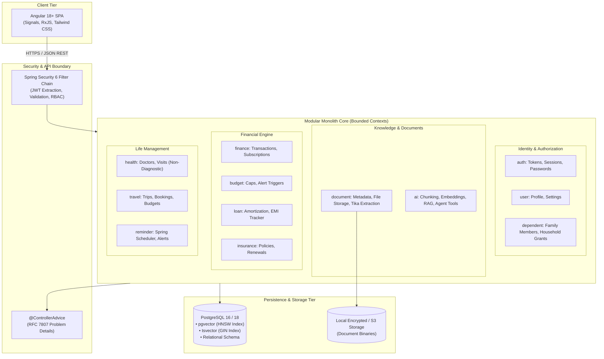

# LifeOS — System Architecture Specification

---

## 1. Architectural Strategy & Design Principles

LifeOS is architected as an **Extensible Modular Monolith** in **Java 21 LTS** and **Spring Boot 3.3.5**. 



### Core Tenets:
1. **High Cohesion, Low Coupling**: Each module represents an independent bounded context with its own entities, DTOs, services, and repositories.
2. **Strict Resource-Level Multi-Tenancy**: Data access is always scoped by `user_id`. No entity can be updated or read without matching ownership.
3. **Hybrid Data Access Pattern**:
   - **Spring Data JPA**: Utilized for standard OLTP transactions, domain entity validation, and parent-child persistence.
   - **Spring Data JDBC / NamedParameterJdbcTemplate**: Utilized for complex analytical queries (e.g., monthly spending summaries, threshold evaluations, raw vector distance queries).
4. **Provider-Agnostic AI Integration**: The AI subsystem defines pure Java interfaces (`LLMProvider`, `EmbeddingProvider`, `VectorStorePort`) to ensure zero lock-in to any single vendor.
5. **Anti-Hallucination & Determinism**: Natural language calculations (e.g., total monthly dues) are always executed via deterministic Java services, never guessed by the LLM.

---

## 2. Package & Directory Structure

```text
com.lifeos
├── common                      # Shared kernel across modules
│   ├── entity                  # BaseEntity (UUID, createdAt, updatedAt, isDeleted)
│   ├── dto                     # ApiResponse<T>, PageResponse<T>, ErrorResponse
│   ├── exception               # ResourceNotFoundException, UnauthorizedException
│   ├── security                # SecurityUtils, UserPrincipal
│   └── util                    # DateUtils, MoneyUtils
│
├── config                      # Central application configurations
│   ├── OpenApiConfig.java      # Swagger / OpenAPI documentation
│   ├── SecurityConfig.java     # Spring Security 6 filter chains & CORS
│   ├── StorageConfig.java      # Local / S3 document storage beans
│   └── AsyncSchedulerConfig    # Thread pools and task scheduling
│
├── auth                        # Authentication & Token Management
│   ├── controller              # AuthController (/api/v1/auth)
│   ├── service                 # AuthService, TokenService, PasswordService
│   ├── dto                     # LoginRequest, RegisterRequest, TokenResponse
│   └── entity                  # RefreshTokenEntity
│
├── user                        # User Profile & Preferences
│   ├── controller              # UserController (/api/v1/users)
│   ├── service                 # UserService
│   ├── repository              # UserRepository
│   └── entity                  # UserEntity, Role
│
├── dependent                   # Family & Household Management
│   ├── controller              # DependentController (/api/v1/dependents)
│   ├── service                 # DependentService
│   └── entity                  # DependentEntity, AccessGrantEntity
│
├── document                    # File Management, Ingestion & Text Extraction
│   ├── controller              # DocumentController (/api/v1/documents)
│   ├── service                 # DocumentService (Upload, Versioning, Two-Stage Deletion)
│   ├── storage                 # DocumentStorageService, LocalStorageService, StorageProperties
│   ├── extractor               # DocumentTextExtractor, TikaDocumentTextExtractor, ExtractionResult
│   ├── repository              # DocumentRepository
│   ├── dto                     # UploadDocumentRequest, DocumentResponse, DocumentDetailResponse
│   └── entity                  # DocumentEntity, DocumentCategory, DocumentType, IngestionStatus
│
├── finance                     # Income, Expenses, Subscriptions & Analytics
│   ├── controller              # TransactionController, RecurringTransactionController, FinanceAnalyticsController
│   ├── service                 # TransactionService, RecurringTransactionService, FinanceAnalyticsService
│   ├── repository              # TransactionRepository, RecurringTransactionRepository, FinanceAnalyticsJdbcRepository
│   ├── dto                     # Transaction & Recurring DTOs, MonthlySummaryResponse, MoM Analytics
│   └── entity                  # TransactionEntity, RecurringTransactionEntity, Enums (Categories, Methods)
│
├── budget                      # Monthly Budgets, Run-Rate Projections & Threshold Alerts
│   ├── controller              # BudgetController (/api/v1/budgets)
│   ├── service                 # BudgetService (Deterministic tracking, alerts, in-flight projections)
│   ├── repository              # BudgetRepository
│   ├── event                   # BudgetThresholdReachedEvent (Decoupled Spring Application Event)
│   ├── dto                     # Create/UpdateBudgetRequest, BudgetResponse, BudgetStatusResponse
│   └── entity                  # BudgetEntity (JSONB alert_thresholds)
│
├── loan                        # Loans, Prepayments, Mathematical Amortization Engine
│   ├── engine                  # LoanAmortizationEngine (Pure deterministic math, DECIMAL128, penny reconciliation)
│   ├── controller              # LoanController (/api/v1/loans)
│   ├── service                 # LoanService, LoanAnalyticsService
│   ├── repository              # LoanRepository, LoanPaymentRepository, LoanAnalyticsJdbcRepository
│   ├── dto                     # Create/UpdateLoanRequest, LoanResponse, RecordLoanPaymentRequest, AmortizationScheduleResponse
│   └── entity                  # LoanEntity, LoanPaymentEntity
│
├── insurance                   # Insurance Portfolio, Policy Renewals & Reminder Sync
│   ├── controller              # InsuranceController (/api/v1/insurance)
│   ├── service                 # InsuranceService (Tenant validation, renewal workflow, reminder sync)
│   ├── repository              # InsurancePolicyRepository
│   ├── dto                     # Create/UpdateInsuranceRequest, RenewPolicyRequest, InsuranceResponse, UpcomingRenewalsResponse
│   └── entity                  # InsurancePolicyEntity
│
├── reminder                    # Background Scheduling & Due Date Reminders
│   ├── repository              # ReminderRepository
│   └── entity                  # ReminderEntity, ReminderStatus
│
├── health                      # Doctors & Appointments (Non-Diagnostic)
│   ├── controller              # HealthController (/api/v1/health)
│   ├── service                 # HealthService, AppointmentReminderBridge
│   ├── repository              # AppointmentRepository, DoctorRepository
│   └── entity                  # HealthAppointmentEntity, DoctorEntity
│
├── travel                      # Trips, Bookings & Itineraries
│   ├── controller              # TravelController (/api/v1/travel)
│   ├── service                 # TripService, TripBudgetService
│   ├── repository              # TripRepository, TripExpenseRepository
│   └── entity                  # TripEntity, TripExpenseEntity
│
├── reminder                    # Background Scheduling & Due Date Scanners
│   ├── service                 # ReminderSchedulerService, NotificationDispatcher
│   ├── repository              # ReminderRepository
│   └── entity                  # ReminderEntity, NotificationEntity
│
└── ai                          # AI, RAG & Agentic Intelligence
    ├── port                    # LLMProvider, EmbeddingProvider, VectorStorePort
    ├── adapter                 # OpenAIProvider, OllamaProvider, PgVectorStoreAdapter
    ├── rag                     # TextChunker, IngestionPipeline, HybridRetriever
    ├── agent                   # AgentOrchestrator, LifeOSToolRegistry, ToolCallHandler
    └── dto                     # ChatMessage, CitationDto, ToolExecutionResult
```

---

## 3. Layered Module Responsibilities

Within each bounded context, LifeOS adheres to strict separation of concerns:

```
[Controller Layer]  ──> Validates input (@Valid), maps HTTP requests, returns DTOs.
       │
[Service Layer]     ──> Implements business rules, enforces tenant authorization, manages transactions.
       │
[Data Access Layer] ──> Spring Data JPA (Domain records) & Spring Data JDBC (Analytics & Vector search).
       │
[Database Layer]    ──> PostgreSQL 16 / 18 (Tables, Constraints, HNSW Vector Index, GIN Lexical Index).
```

### Key Conventions:
* **Entities are NEVER exposed via REST**: Controllers only receive and return strictly typed DTOs.
* **Mappers**: Strongly typed mapping methods or MapStruct mappers translate entities to DTOs.
* **Auditability**: All domain tables inherit from `BaseEntity` (`id`, `created_at`, `updated_at`, `is_deleted`).

---

## 4. Extensibility Architecture

LifeOS is designed so future modules (e.g., *Vehicle Management*, *Property Portfolio*, *Tax Management*, *Warranty Tracker*) can be added seamlessly:

1. **Pluggable Document Attachment**: Any future domain entity can be associated with uploaded documents via the generic `document_entity_links` junction table.
2. **Pluggable Agent Tools**: New modules register tools with the AI assistant simply by implementing the `LifeOSTool` interface and annotating with `@Component`. The `AgentOrchestrator` dynamically discovers all registered tools.
3. **Pluggable Event Notification**: Reminders and triggers post events through a standard `LifeOSEventPublisher`, allowing future notification channels (SMS, WhatsApp, Email, WebPush) to listen without altering domain logic.

---

## 5. Non-Functional & Reliability Architecture

* **High Performance Database Queries**: Multi-column composite indexes on `(user_id, created_at)` and `(user_id, status)` ensure single-millisecond response times even with hundreds of thousands of records.
* **Stateless Scaling**: No HTTP sessions are stored in memory; all authentication state resides in signed, short-lived JWTs.
* **Graceful Degradation**: If the external AI API is unreachable or times out, standard CRUD and search features continue operating without disruption.
