# LifeOS — Database Design & Schema Specification

---

## 1. Relational Entity-Relationship Diagram

```mermaid
erDiagram
    USERS ||--o{ REFRESH_TOKENS : has
    USERS ||--o{ DEPENDENTS : manages
    USERS ||--o{ DOCUMENTS : owns
    USERS ||--o{ INSURANCE_POLICIES : holds
    USERS ||--o{ LOANS : owes
    USERS ||--o{ HEALTH_APPOINTMENTS : schedules
    USERS ||--o{ TRIPS : plans
    USERS ||--o{ TRANSACTIONS : records
    USERS ||--o{ BUDGETS : defines
    USERS ||--o{ REMINDERS : configures
    USERS ||--o{ CONVERSATIONS : conducts

    DOCUMENTS ||--o{ DOCUMENT_CHUNKS : contains
    DOCUMENTS ||--o{ DOCUMENT_ENTITY_LINKS : links

    LOANS ||--o{ LOAN_PAYMENTS : tracks
    TRIPS ||--o{ TRIP_EXPENSES : incurs
    CONVERSATIONS ||--o{ CHAT_MESSAGES : contains
    CHAT_MESSAGES ||--o{ MESSAGE_CITATIONS : references

    USERS {
        uuid id PK
        varchar email UK
        varchar password_hash
        varchar first_name
        varchar last_name
        varchar phone
        varchar role
        jsonb preferences
        boolean is_active
        timestamp created_at
        timestamp updated_at
    }

    DEPENDENTS {
        uuid id PK
        uuid user_id FK
        varchar full_name
        varchar relationship
        date date_of_birth
        varchar emergency_phone
        jsonb medical_notes
        timestamp created_at
    }

    DOCUMENTS {
        uuid id PK
        uuid user_id FK
        varchar title
        varchar original_filename
        varchar storage_path
        varchar mime_type
        bigint file_size
        varchar category
        varchar document_type
        date issue_date
        date expiry_date
        jsonb tags
        varchar checksum_sha256
        varchar ingestion_status
        timestamp created_at
    }

    DOCUMENT_CHUNKS {
        uuid id PK
        uuid document_id FK
        uuid user_id FK
        int chunk_index
        text content
        vector_1536 embedding
        tsvector tsv_content
        int page_number
        jsonb metadata
        timestamp created_at
    }

    INSURANCE_POLICIES {
        uuid id PK
        uuid user_id FK
        uuid dependent_id FK
        uuid document_id FK
        varchar policy_number
        varchar provider_name
        varchar policy_type
        numeric coverage_amount
        numeric premium_amount
        varchar premium_frequency
        date start_date
        date expiry_date
        date next_renewal_date
        varchar status
        timestamp created_at
    }

    LOANS {
        uuid id PK
        uuid user_id FK
        uuid document_id FK
        varchar loan_account_number
        varchar lender_name
        varchar loan_type
        numeric principal_amount
        numeric outstanding_balance
        numeric interest_rate
        int tenure_months
        numeric monthly_emi
        int emi_due_day
        date start_date
        date end_date
        varchar status
        timestamp created_at
    }

    LOAN_PAYMENTS {
        uuid id PK
        uuid loan_id FK
        numeric payment_amount
        numeric principal_component
        numeric interest_component
        date payment_date
        varchar transaction_ref
        timestamp created_at
    }

    HEALTH_APPOINTMENTS {
        uuid id PK
        uuid user_id FK
        uuid dependent_id FK
        uuid document_id FK
        varchar doctor_name
        varchar specialization
        varchar clinic_or_hospital
        timestamp appointment_time
        varchar purpose
        text notes
        varchar status
        timestamp created_at
    }

    TRIPS {
        uuid id PK
        uuid user_id FK
        varchar destination
        varchar trip_title
        date start_date
        date end_date
        numeric total_budget
        numeric actual_spend
        varchar status
        timestamp created_at
    }

    TRIP_EXPENSES {
        uuid id PK
        uuid trip_id FK
        numeric amount
        varchar category
        varchar description
        date expense_date
        timestamp created_at
    }

    TRANSACTIONS {
        uuid id PK
        uuid user_id FK
        numeric amount
        varchar transaction_type
        varchar category
        date transaction_date
        varchar payment_method
        varchar description
        boolean is_recurring
        timestamp created_at
    }

    BUDGETS {
        uuid id PK
        uuid user_id FK
        varchar category
        int budget_month
        int budget_year
        numeric allocated_amount
        numeric alert_threshold_percentage
        timestamp created_at
    }

    REMINDERS {
        uuid id PK
        uuid user_id FK
        varchar title
        text description
        timestamp due_at
        varchar recurrence_pattern
        varchar reminder_type
        varchar status
        uuid target_entity_id
        timestamp created_at
    }

    CONVERSATIONS {
        uuid id PK
        uuid user_id FK
        varchar title
        timestamp created_at
        timestamp last_message_at
    }

    CHAT_MESSAGES {
        uuid id PK
        uuid conversation_id FK
        varchar sender_role
        text content
        jsonb tool_calls
        timestamp created_at
    }

    MESSAGE_CITATIONS {
        uuid id PK
        uuid message_id FK
        uuid document_id FK
        uuid chunk_id FK
        int page_number
        text snippet
        numeric confidence_score
        timestamp created_at
    }
```



---

## 2. Complete Database DDL Reference (PostgreSQL 16 + pgvector)

The following DDL establishes the full database schema. In Phase 2, this serves as the foundational Flyway migration `V1__init_schema.sql`.

```sql
-- ============================================================================
-- EXTENSIONS
-- ============================================================================
CREATE EXTENSION IF NOT EXISTS "uuid-ossp";
CREATE EXTENSION IF NOT EXISTS vector;

-- ============================================================================
-- 1. USERS & IDENTITY
-- ============================================================================
CREATE TABLE users (
    id UUID PRIMARY KEY DEFAULT gen_random_uuid(),
    email VARCHAR(255) NOT NULL UNIQUE,
    password_hash VARCHAR(255) NOT NULL,
    first_name VARCHAR(100) NOT NULL,
    last_name VARCHAR(100) NOT NULL,
    phone VARCHAR(30),
    role VARCHAR(50) NOT NULL DEFAULT 'ROLE_USER',
    preferences JSONB DEFAULT '{}'::jsonb,
    is_active BOOLEAN NOT NULL DEFAULT TRUE,
    is_deleted BOOLEAN NOT NULL DEFAULT FALSE,
    created_at TIMESTAMP WITH TIME ZONE NOT NULL DEFAULT CURRENT_TIMESTAMP,
    updated_at TIMESTAMP WITH TIME ZONE NOT NULL DEFAULT CURRENT_TIMESTAMP
);

CREATE INDEX idx_users_email ON users(email) WHERE NOT is_deleted;

CREATE TABLE refresh_tokens (
    id UUID PRIMARY KEY DEFAULT gen_random_uuid(),
    user_id UUID NOT NULL REFERENCES users(id) ON DELETE CASCADE,
    token_hash VARCHAR(255) NOT NULL UNIQUE,
    expires_at TIMESTAMP WITH TIME ZONE NOT NULL,
    is_revoked BOOLEAN NOT NULL DEFAULT FALSE,
    created_at TIMESTAMP WITH TIME ZONE NOT NULL DEFAULT CURRENT_TIMESTAMP
);

CREATE INDEX idx_refresh_tokens_user ON refresh_tokens(user_id);

-- ============================================================================
-- 2. FAMILY & DEPENDENTS
-- ============================================================================
CREATE TABLE dependents (
    id UUID PRIMARY KEY DEFAULT gen_random_uuid(),
    user_id UUID NOT NULL REFERENCES users(id) ON DELETE CASCADE,
    full_name VARCHAR(150) NOT NULL,
    relationship VARCHAR(50) NOT NULL, -- PARENT, SPOUSE, CHILD, OTHER
    date_of_birth DATE,
    emergency_phone VARCHAR(30),
    medical_notes JSONB DEFAULT '{}'::jsonb,
    is_deleted BOOLEAN NOT NULL DEFAULT FALSE,
    created_at TIMESTAMP WITH TIME ZONE NOT NULL DEFAULT CURRENT_TIMESTAMP,
    updated_at TIMESTAMP WITH TIME ZONE NOT NULL DEFAULT CURRENT_TIMESTAMP
);

CREATE INDEX idx_dependents_user ON dependents(user_id) WHERE NOT is_deleted;

-- ============================================================================
-- 3. DOCUMENTS & VECTOR STORAGE
-- ============================================================================
CREATE TABLE documents (
    id UUID PRIMARY KEY DEFAULT gen_random_uuid(),
    user_id UUID NOT NULL REFERENCES users(id) ON DELETE CASCADE,
    dependent_id UUID REFERENCES dependents(id) ON DELETE SET NULL,
    title VARCHAR(255) NOT NULL,
    original_filename VARCHAR(255) NOT NULL,
    storage_path VARCHAR(500) NOT NULL,
    mime_type VARCHAR(100) NOT NULL,
    file_size BIGINT NOT NULL,
    category VARCHAR(50) NOT NULL, -- INSURANCE, LOAN, HEALTH, TAX, IDENTITY, WARRANTY, TRAVEL
    document_type VARCHAR(50),
    issue_date DATE,
    expiry_date DATE,
    tags JSONB DEFAULT '[]'::jsonb,
    checksum_sha256 VARCHAR(64) NOT NULL,
    ingestion_status VARCHAR(30) NOT NULL DEFAULT 'PENDING', -- PENDING, PROCESSING, COMPLETED, FAILED
    is_deleted BOOLEAN NOT NULL DEFAULT FALSE,
    created_at TIMESTAMP WITH TIME ZONE NOT NULL DEFAULT CURRENT_TIMESTAMP,
    updated_at TIMESTAMP WITH TIME ZONE NOT NULL DEFAULT CURRENT_TIMESTAMP
);

CREATE INDEX idx_documents_user_cat ON documents(user_id, category) WHERE NOT is_deleted;
CREATE INDEX idx_documents_expiry ON documents(expiry_date) WHERE expiry_date IS NOT NULL AND NOT is_deleted;

CREATE TABLE document_chunks (
    id UUID PRIMARY KEY DEFAULT gen_random_uuid(),
    document_id UUID NOT NULL REFERENCES documents(id) ON DELETE CASCADE,
    user_id UUID NOT NULL REFERENCES users(id) ON DELETE CASCADE,
    chunk_index INT NOT NULL,
    content TEXT NOT NULL,
    embedding vector(1536),
    tsv_content TSVECTOR GENERATED ALWAYS AS (to_tsvector('english', content)) STORED,
    page_number INT NOT NULL DEFAULT 1,
    metadata JSONB DEFAULT '{}'::jsonb,
    created_at TIMESTAMP WITH TIME ZONE NOT NULL DEFAULT CURRENT_TIMESTAMP
);

-- Hybrid Search Indexes: HNSW for dense vector, GIN for sparse lexical
CREATE INDEX idx_chunks_hnsw ON document_chunks USING hnsw (embedding vector_cosine_ops) WITH (m = 16, ef_construction = 64);
CREATE INDEX idx_chunks_tsv ON document_chunks USING gin (tsv_content);
CREATE INDEX idx_chunks_user_doc ON document_chunks(user_id, document_id);

CREATE TABLE document_entity_links (
    id UUID PRIMARY KEY DEFAULT gen_random_uuid(),
    document_id UUID NOT NULL REFERENCES documents(id) ON DELETE CASCADE,
    entity_type VARCHAR(50) NOT NULL, -- INSURANCE, LOAN, HEALTH_APPOINTMENT, TRIP
    entity_id UUID NOT NULL,
    created_at TIMESTAMP WITH TIME ZONE NOT NULL DEFAULT CURRENT_TIMESTAMP
);

CREATE INDEX idx_entity_links ON document_entity_links(entity_type, entity_id);

-- ============================================================================
-- 4. INSURANCE POLICIES
-- ============================================================================
CREATE TABLE insurance_policies (
    id UUID PRIMARY KEY DEFAULT gen_random_uuid(),
    user_id UUID NOT NULL REFERENCES users(id) ON DELETE CASCADE,
    dependent_id UUID REFERENCES dependents(id) ON DELETE SET NULL,
    document_id UUID REFERENCES documents(id) ON DELETE SET NULL,
    policy_number VARCHAR(100) NOT NULL,
    provider_name VARCHAR(150) NOT NULL,
    policy_type VARCHAR(50) NOT NULL, -- HEALTH, LIFE, VEHICLE, HOME, TRAVEL, OTHER
    coverage_amount NUMERIC(15,2) NOT NULL,
    premium_amount NUMERIC(12,2) NOT NULL,
    premium_frequency VARCHAR(30) NOT NULL, -- MONTHLY, QUARTERLY, ANNUALLY
    start_date DATE NOT NULL,
    expiry_date DATE NOT NULL,
    next_renewal_date DATE NOT NULL,
    status VARCHAR(30) NOT NULL DEFAULT 'ACTIVE', -- ACTIVE, EXPIRED, CANCELLED
    is_deleted BOOLEAN NOT NULL DEFAULT FALSE,
    created_at TIMESTAMP WITH TIME ZONE NOT NULL DEFAULT CURRENT_TIMESTAMP,
    updated_at TIMESTAMP WITH TIME ZONE NOT NULL DEFAULT CURRENT_TIMESTAMP
);

CREATE INDEX idx_insurance_user ON insurance_policies(user_id) WHERE NOT is_deleted;
CREATE INDEX idx_insurance_renewal ON insurance_policies(next_renewal_date) WHERE status = 'ACTIVE' AND NOT is_deleted;

-- ============================================================================
-- 5. LOANS & AMORTIZATION
-- ============================================================================
CREATE TABLE loans (
    id UUID PRIMARY KEY DEFAULT gen_random_uuid(),
    user_id UUID NOT NULL REFERENCES users(id) ON DELETE CASCADE,
    document_id UUID REFERENCES documents(id) ON DELETE SET NULL,
    loan_account_number VARCHAR(100) NOT NULL,
    lender_name VARCHAR(150) NOT NULL,
    loan_type VARCHAR(50) NOT NULL, -- HOME, VEHICLE, EDUCATION, PERSONAL, OTHER
    principal_amount NUMERIC(15,2) NOT NULL,
    outstanding_balance NUMERIC(15,2) NOT NULL,
    interest_rate NUMERIC(5,2) NOT NULL,
    tenure_months INT NOT NULL,
    monthly_emi NUMERIC(12,2) NOT NULL,
    emi_due_day INT NOT NULL CHECK (emi_due_day BETWEEN 1 AND 31),
    start_date DATE NOT NULL,
    end_date DATE NOT NULL,
    status VARCHAR(30) NOT NULL DEFAULT 'ACTIVE', -- ACTIVE, CLOSED, DEFAULTED
    is_deleted BOOLEAN NOT NULL DEFAULT FALSE,
    created_at TIMESTAMP WITH TIME ZONE NOT NULL DEFAULT CURRENT_TIMESTAMP,
    updated_at TIMESTAMP WITH TIME ZONE NOT NULL DEFAULT CURRENT_TIMESTAMP
);

CREATE INDEX idx_loans_user ON loans(user_id) WHERE NOT is_deleted;

CREATE TABLE loan_payments (
    id UUID PRIMARY KEY DEFAULT gen_random_uuid(),
    loan_id UUID NOT NULL REFERENCES loans(id) ON DELETE CASCADE,
    payment_amount NUMERIC(12,2) NOT NULL,
    principal_component NUMERIC(12,2) NOT NULL,
    interest_component NUMERIC(12,2) NOT NULL,
    payment_date DATE NOT NULL,
    transaction_ref VARCHAR(100),
    created_at TIMESTAMP WITH TIME ZONE NOT NULL DEFAULT CURRENT_TIMESTAMP
);

CREATE INDEX idx_loan_payments_loan ON loan_payments(loan_id);

-- ============================================================================
-- 6. HEALTH & DOCTOR APPOINTMENTS (NON-DIAGNOSTIC)
-- ============================================================================
CREATE TABLE health_appointments (
    id UUID PRIMARY KEY DEFAULT gen_random_uuid(),
    user_id UUID NOT NULL REFERENCES users(id) ON DELETE CASCADE,
    dependent_id UUID REFERENCES dependents(id) ON DELETE SET NULL,
    document_id UUID REFERENCES documents(id) ON DELETE SET NULL,
    doctor_name VARCHAR(150) NOT NULL,
    specialization VARCHAR(100) NOT NULL,
    clinic_or_hospital VARCHAR(200) NOT NULL,
    appointment_time TIMESTAMP WITH TIME ZONE NOT NULL,
    purpose VARCHAR(255) NOT NULL,
    notes TEXT,
    status VARCHAR(30) NOT NULL DEFAULT 'SCHEDULED', -- SCHEDULED, COMPLETED, CANCELLED
    is_deleted BOOLEAN NOT NULL DEFAULT FALSE,
    created_at TIMESTAMP WITH TIME ZONE NOT NULL DEFAULT CURRENT_TIMESTAMP,
    updated_at TIMESTAMP WITH TIME ZONE NOT NULL DEFAULT CURRENT_TIMESTAMP
);

CREATE INDEX idx_health_user ON health_appointments(user_id) WHERE NOT is_deleted;
CREATE INDEX idx_health_time ON health_appointments(appointment_time);

-- ============================================================================
-- 7. TRAVEL & TRIPS
-- ============================================================================
CREATE TABLE trips (
    id UUID PRIMARY KEY DEFAULT gen_random_uuid(),
    user_id UUID NOT NULL REFERENCES users(id) ON DELETE CASCADE,
    destination VARCHAR(200) NOT NULL,
    trip_title VARCHAR(200) NOT NULL,
    start_date DATE NOT NULL,
    end_date DATE NOT NULL,
    total_budget NUMERIC(12,2) NOT NULL DEFAULT 0.00,
    actual_spend NUMERIC(12,2) NOT NULL DEFAULT 0.00,
    status VARCHAR(30) NOT NULL DEFAULT 'PLANNED', -- PLANNED, ONGOING, COMPLETED
    is_deleted BOOLEAN NOT NULL DEFAULT FALSE,
    created_at TIMESTAMP WITH TIME ZONE NOT NULL DEFAULT CURRENT_TIMESTAMP,
    updated_at TIMESTAMP WITH TIME ZONE NOT NULL DEFAULT CURRENT_TIMESTAMP
);

CREATE INDEX idx_trips_user ON trips(user_id) WHERE NOT is_deleted;

CREATE TABLE trip_expenses (
    id UUID PRIMARY KEY DEFAULT gen_random_uuid(),
    trip_id UUID NOT NULL REFERENCES trips(id) ON DELETE CASCADE,
    amount NUMERIC(12,2) NOT NULL,
    category VARCHAR(50) NOT NULL, -- FLIGHT, HOTEL, FOOD, TRANSPORT, ACTIVITIES, OTHER
    description VARCHAR(255) NOT NULL,
    expense_date DATE NOT NULL,
    created_at TIMESTAMP WITH TIME ZONE NOT NULL DEFAULT CURRENT_TIMESTAMP
);

CREATE INDEX idx_trip_expenses_trip ON trip_expenses(trip_id);

-- ============================================================================
-- 8. PERSONAL FINANCE & MONTHLY BUDGETS
-- ============================================================================
CREATE TABLE transactions (
    id UUID PRIMARY KEY DEFAULT gen_random_uuid(),
    user_id UUID NOT NULL REFERENCES users(id) ON DELETE CASCADE,
    amount NUMERIC(12,2) NOT NULL,
    transaction_type VARCHAR(20) NOT NULL, -- INCOME, EXPENSE
    category VARCHAR(50) NOT NULL, -- RENT, FOOD, TRAVEL, SHOPPING, EDUCATION, HEALTH, BILLS, EMI, INSURANCE, OTHER
    transaction_date DATE NOT NULL,
    payment_method VARCHAR(50) NOT NULL, -- CREDIT_CARD, DEBIT_CARD, UPI, CASH, NET_BANKING
    description VARCHAR(255) NOT NULL,
    is_recurring BOOLEAN NOT NULL DEFAULT FALSE,
    is_deleted BOOLEAN NOT NULL DEFAULT FALSE,
    created_at TIMESTAMP WITH TIME ZONE NOT NULL DEFAULT CURRENT_TIMESTAMP
);

CREATE INDEX idx_transactions_user_date ON transactions(user_id, transaction_date) WHERE NOT is_deleted;
CREATE INDEX idx_transactions_category ON transactions(user_id, category) WHERE NOT is_deleted;

CREATE TABLE budgets (
    id UUID PRIMARY KEY DEFAULT gen_random_uuid(),
    user_id UUID NOT NULL REFERENCES users(id) ON DELETE CASCADE,
    category VARCHAR(50) NOT NULL,
    budget_month INT NOT NULL CHECK (budget_month BETWEEN 1 AND 12),
    budget_year INT NOT NULL CHECK (budget_year >= 2020),
    allocated_amount NUMERIC(12,2) NOT NULL,
    alert_threshold_percentage NUMERIC(5,2) NOT NULL DEFAULT 80.00,
    created_at TIMESTAMP WITH TIME ZONE NOT NULL DEFAULT CURRENT_TIMESTAMP,
    CONSTRAINT uq_user_cat_month_year UNIQUE (user_id, category, budget_month, budget_year)
);

-- ============================================================================
-- 9. AUTOMATION & REMINDERS
-- ============================================================================
CREATE TABLE reminders (
    id UUID PRIMARY KEY DEFAULT gen_random_uuid(),
    user_id UUID NOT NULL REFERENCES users(id) ON DELETE CASCADE,
    title VARCHAR(200) NOT NULL,
    description TEXT,
    due_at TIMESTAMP WITH TIME ZONE NOT NULL,
    recurrence_pattern VARCHAR(50), -- ONCE, DAILY, WEEKLY, MONTHLY, ANNUALLY
    reminder_type VARCHAR(50) NOT NULL, -- INSURANCE_RENEWAL, LOAN_EMI, APPOINTMENT, BILL, WARRANTY, CUSTOM
    status VARCHAR(30) NOT NULL DEFAULT 'ACTIVE', -- ACTIVE, COMPLETED, DISMISSED
    target_entity_id UUID,
    created_at TIMESTAMP WITH TIME ZONE NOT NULL DEFAULT CURRENT_TIMESTAMP
);

CREATE INDEX idx_reminders_scanner ON reminders(status, due_at);

-- ============================================================================
-- 10. AI CONVERSATIONS & CITATIONS
-- ============================================================================
CREATE TABLE conversations (
    id UUID PRIMARY KEY DEFAULT gen_random_uuid(),
    user_id UUID NOT NULL REFERENCES users(id) ON DELETE CASCADE,
    title VARCHAR(200) NOT NULL DEFAULT 'New Conversation',
    created_at TIMESTAMP WITH TIME ZONE NOT NULL DEFAULT CURRENT_TIMESTAMP,
    last_message_at TIMESTAMP WITH TIME ZONE NOT NULL DEFAULT CURRENT_TIMESTAMP
);

CREATE INDEX idx_conversations_user ON conversations(user_id);

CREATE TABLE chat_messages (
    id UUID PRIMARY KEY DEFAULT gen_random_uuid(),
    conversation_id UUID NOT NULL REFERENCES conversations(id) ON DELETE CASCADE,
    sender_role VARCHAR(20) NOT NULL, -- USER, ASSISTANT, SYSTEM
    content TEXT NOT NULL,
    tool_calls JSONB DEFAULT '[]'::jsonb,
    created_at TIMESTAMP WITH TIME ZONE NOT NULL DEFAULT CURRENT_TIMESTAMP
);

CREATE INDEX idx_chat_messages_conv ON chat_messages(conversation_id, created_at);

CREATE TABLE message_citations (
    id UUID PRIMARY KEY DEFAULT gen_random_uuid(),
    message_id UUID NOT NULL REFERENCES chat_messages(id) ON DELETE CASCADE,
    document_id UUID NOT NULL REFERENCES documents(id) ON DELETE CASCADE,
    chunk_id UUID REFERENCES document_chunks(id) ON DELETE SET NULL,
    page_number INT NOT NULL,
    snippet TEXT NOT NULL,
    confidence_score NUMERIC(5,4) NOT NULL,
    created_at TIMESTAMP WITH TIME ZONE NOT NULL DEFAULT CURRENT_TIMESTAMP
);

CREATE INDEX idx_citations_message ON message_citations(message_id);
```

---

## 3. Indexing & Vector Search Optimization

### HNSW vs IVFFlat Strategy
LifeOS specifies **HNSW (Hierarchical Navigable Small World)** with cosine distance (`vector_cosine_ops`):
* `m = 16`: Number of bidirectional links created per vector element (optimal balance between build memory and recall).
* `ef_construction = 64`: Size of the dynamic candidate list during graph construction (ensures >98% recall accuracy).
* Unlike IVFFlat, HNSW does not require an initial training clustering step and supports real-time concurrent insertions during document ingestion.

### Sparse Lexical GIN Indexing
PostgreSQL generated column `tsv_content` converts English text chunks into indexed lexemes with stop-word elimination and stemming. Combining this with dense HNSW provides state-of-the-art hybrid search capabilities directly within PostgreSQL.
