# LifeOS — Database Design & Schema Specification

---

## 1. Relational Entity-Relationship Diagram

```mermaid
erDiagram
    USERS ||--o{ REFRESH_TOKENS : has
    USERS ||--o{ DEPENDENTS : manages
    USERS ||--o{ DOCUMENTS : owns
    USERS ||--o{ INSURANCE_POLICIES : holds
    USERS ||--o{ LOANS : owes
    USERS ||--o{ HEALTH_APPOINTMENTS : schedules
    USERS ||--o{ TRIPS : plans
    USERS ||--o{ TRANSACTIONS : records
    USERS ||--o{ BUDGETS : defines
    USERS ||--o{ REMINDERS : configures
    USERS ||--o{ CONVERSATIONS : conducts

    DOCUMENTS ||--o{ DOCUMENT_CHUNKS : contains
    DOCUMENTS ||--o{ DOCUMENT_ENTITY_LINKS : links

    LOANS ||--o{ LOAN_PAYMENTS : tracks
    TRIPS ||--o{ TRIP_EXPENSES : incurs
    CONVERSATIONS ||--o{ CHAT_MESSAGES : contains
    CHAT_MESSAGES ||--o{ MESSAGE_CITATIONS : references

    USERS {
        uuid id PK
        varchar email UK
        varchar password_hash
        varchar first_name
        varchar last_name
        varchar phone
        varchar role
        jsonb preferences
        boolean is_active
        timestamp created_at
        timestamp updated_at
    }

    DEPENDENTS {
        uuid id PK
        uuid user_id FK
        varchar full_name
        varchar relationship
        date date_of_birth
        varchar emergency_phone
        jsonb medical_notes
        timestamp created_at
    }

    DOCUMENTS {
        uuid id PK
        uuid user_id FK
        uuid dependent_id FK
        varchar title
        varchar original_filename
        varchar storage_path
        varchar mime_type
        bigint file_size
        varchar category
        varchar document_type
        date issue_date
        date expiry_date
        jsonb tags
        varchar checksum_sha256
        varchar ingestion_status
        int version
        text extracted_text
        jsonb metadata
        text extraction_error
        timestamp created_at
    }

    DOCUMENT_CHUNKS {
        uuid id PK
        uuid document_id FK
        uuid user_id FK
        int chunk_index
        text content
        vector_1536 embedding
        tsvector tsv_content
        int page_number
        jsonb metadata
        timestamp created_at
    }

    INSURANCE_POLICIES {
        uuid id PK
        uuid user_id FK
        uuid dependent_id FK
        uuid document_id FK
        varchar policy_number
        varchar provider_name
        varchar policy_type
        numeric coverage_amount
        numeric premium_amount
        varchar premium_frequency
        date start_date
        date expiry_date
        date next_renewal_date
        varchar status
        timestamp created_at
    }

    LOANS {
        uuid id PK
        uuid user_id FK
        uuid document_id FK
        varchar loan_account_number
        varchar lender_name
        varchar loan_type
        numeric principal_amount
        numeric outstanding_balance
        numeric interest_rate
        int tenure_months
        numeric monthly_emi
        int emi_due_day
        date start_date
        date end_date
        varchar status
        timestamp created_at
    }

    LOAN_PAYMENTS {
        uuid id PK
        uuid loan_id FK
        numeric payment_amount
        numeric principal_component
        numeric interest_component
        date payment_date
        varchar transaction_ref
        timestamp created_at
    }

    HEALTH_APPOINTMENTS {
        uuid id PK
        uuid user_id FK
        uuid dependent_id FK
        uuid document_id FK
        varchar doctor_name
        varchar specialization
        varchar clinic_or_hospital
        timestamp appointment_time
        varchar purpose
        text notes
        varchar status
        timestamp created_at
    }

    TRIPS {
        uuid id PK
        uuid user_id FK
        varchar destination
        varchar trip_title
        date start_date
        date end_date
        numeric total_budget
        numeric actual_spend
        varchar status
        timestamp created_at
    }

    TRIP_EXPENSES {
        uuid id PK
        uuid trip_id FK
        numeric amount
        varchar category
        varchar description
        date expense_date
        timestamp created_at
    }

    RECURRING_TRANSACTIONS {
        uuid id PK
        uuid user_id FK
        varchar title
        numeric amount
        varchar transaction_type
        varchar category
        varchar payment_method
        varchar recurrence_pattern
        int billing_day
        date start_date
        date end_date
        date next_due_date
        varchar status
        boolean auto_create_transaction
        boolean is_deleted
        timestamp created_at
    }

    TRANSACTIONS {
        uuid id PK
        uuid user_id FK
        uuid document_id FK
        uuid recurring_id FK
        numeric amount
        varchar transaction_type
        varchar category
        date transaction_date
        varchar payment_method
        varchar description
        varchar status
        boolean is_recurring
        boolean is_refund
        boolean is_deleted
        timestamp created_at
    }

    BUDGETS {
        uuid id PK
        uuid user_id FK
        varchar category
        int budget_month
        int budget_year
        numeric allocated_amount
        jsonb alert_thresholds
        boolean is_deleted
        timestamp created_at
    }

    REMINDERS {
        uuid id PK
        uuid user_id FK
        varchar title
        text description
        timestamp due_at
        varchar recurrence_pattern
        varchar reminder_type
        varchar status
        uuid target_entity_id
        timestamp created_at
    }

    CONVERSATIONS {
        uuid id PK
        uuid user_id FK
        varchar title
        timestamp created_at
        timestamp last_message_at
    }

    CHAT_MESSAGES {
        uuid id PK
        uuid conversation_id FK
        varchar sender_role
        text content
        jsonb tool_calls
        timestamp created_at
    }

    MESSAGE_CITATIONS {
        uuid id PK
        uuid message_id FK
        uuid document_id FK
        uuid chunk_id FK
        int page_number
        text snippet
        numeric confidence_score
        timestamp created_at
    }
```



---

## 2. Complete Database DDL Reference (PostgreSQL 16 / 18 + pgvector)

The following DDL establishes the full database schema. In Phase 2, this serves as the foundational Flyway migration `V1__init_schema.sql`.

```sql
-- ============================================================================
-- EXTENSIONS
-- ============================================================================
CREATE EXTENSION IF NOT EXISTS "uuid-ossp";
CREATE EXTENSION IF NOT EXISTS vector;

-- ============================================================================
-- 1. USERS & IDENTITY
-- ============================================================================
CREATE TABLE users (
    id UUID PRIMARY KEY DEFAULT gen_random_uuid(),
    email VARCHAR(255) NOT NULL UNIQUE,
    password_hash VARCHAR(255) NOT NULL,
    first_name VARCHAR(100) NOT NULL,
    last_name VARCHAR(100) NOT NULL,
    phone VARCHAR(30),
    role VARCHAR(50) NOT NULL DEFAULT 'ROLE_USER',
    preferences JSONB DEFAULT '{}'::jsonb,
    is_active BOOLEAN NOT NULL DEFAULT TRUE,
    is_deleted BOOLEAN NOT NULL DEFAULT FALSE,
    created_at TIMESTAMP WITH TIME ZONE NOT NULL DEFAULT CURRENT_TIMESTAMP,
    updated_at TIMESTAMP WITH TIME ZONE NOT NULL DEFAULT CURRENT_TIMESTAMP
);

CREATE INDEX idx_users_email ON users(email) WHERE NOT is_deleted;

CREATE TABLE refresh_tokens (
    id UUID PRIMARY KEY DEFAULT gen_random_uuid(),
    user_id UUID NOT NULL REFERENCES users(id) ON DELETE CASCADE,
    token_hash VARCHAR(255) NOT NULL UNIQUE,
    expires_at TIMESTAMP WITH TIME ZONE NOT NULL,
    is_revoked BOOLEAN NOT NULL DEFAULT FALSE,
    created_at TIMESTAMP WITH TIME ZONE NOT NULL DEFAULT CURRENT_TIMESTAMP
);

CREATE INDEX idx_refresh_tokens_user ON refresh_tokens(user_id);

-- ============================================================================
-- 2. FAMILY & DEPENDENTS
-- ============================================================================
CREATE TABLE dependents (
    id UUID PRIMARY KEY DEFAULT gen_random_uuid(),
    user_id UUID NOT NULL REFERENCES users(id) ON DELETE CASCADE,
    full_name VARCHAR(150) NOT NULL,
    relationship VARCHAR(50) NOT NULL, -- PARENT, SPOUSE, CHILD, OTHER
    date_of_birth DATE,
    emergency_phone VARCHAR(30),
    medical_notes JSONB DEFAULT '{}'::jsonb,
    is_deleted BOOLEAN NOT NULL DEFAULT FALSE,
    created_at TIMESTAMP WITH TIME ZONE NOT NULL DEFAULT CURRENT_TIMESTAMP,
    updated_at TIMESTAMP WITH TIME ZONE NOT NULL DEFAULT CURRENT_TIMESTAMP
);

CREATE INDEX idx_dependents_user ON dependents(user_id) WHERE NOT is_deleted;

-- ============================================================================
-- 3. DOCUMENTS & VECTOR STORAGE
-- ============================================================================
CREATE TABLE documents (
    id UUID PRIMARY KEY DEFAULT gen_random_uuid(),
    user_id UUID NOT NULL REFERENCES users(id) ON DELETE CASCADE,
    dependent_id UUID REFERENCES dependents(id) ON DELETE SET NULL,
    title VARCHAR(255) NOT NULL,
    original_filename VARCHAR(255) NOT NULL,
    storage_path VARCHAR(500) NOT NULL,
    mime_type VARCHAR(100) NOT NULL,
    file_size BIGINT NOT NULL,
    category VARCHAR(50) NOT NULL, -- INSURANCE, LOAN, HEALTH, TAX, IDENTITY, WARRANTY, TRAVEL
    document_type VARCHAR(50),
    issue_date DATE,
    expiry_date DATE,
    tags JSONB DEFAULT '[]'::jsonb,
    checksum_sha256 VARCHAR(64) NOT NULL,
    ingestion_status VARCHAR(30) NOT NULL DEFAULT 'PENDING', -- PENDING, PROCESSING, COMPLETED, FAILED
    is_deleted BOOLEAN NOT NULL DEFAULT FALSE,
    created_at TIMESTAMP WITH TIME ZONE NOT NULL DEFAULT CURRENT_TIMESTAMP,
    updated_at TIMESTAMP WITH TIME ZONE NOT NULL DEFAULT CURRENT_TIMESTAMP
);

CREATE INDEX idx_documents_user_cat ON documents(user_id, category) WHERE NOT is_deleted;
CREATE INDEX idx_documents_expiry ON documents(expiry_date) WHERE expiry_date IS NOT NULL AND NOT is_deleted;

CREATE TABLE document_chunks (
    id UUID PRIMARY KEY DEFAULT gen_random_uuid(),
    document_id UUID NOT NULL REFERENCES documents(id) ON DELETE CASCADE,
    user_id UUID NOT NULL REFERENCES users(id) ON DELETE CASCADE,
    chunk_index INT NOT NULL,
    content TEXT NOT NULL,
    embedding vector(1536),
    tsv_content TSVECTOR GENERATED ALWAYS AS (to_tsvector('english', content)) STORED,
    page_number INT NOT NULL DEFAULT 1,
    document_version INT NOT NULL DEFAULT 1,
    section_title VARCHAR(255),
    token_count INT,
    char_count INT,
    is_active BOOLEAN NOT NULL DEFAULT TRUE,
    embedding_model VARCHAR(100) DEFAULT 'text-embedding-3-small',
    metadata JSONB DEFAULT '{}'::jsonb,
    created_at TIMESTAMP WITH TIME ZONE NOT NULL DEFAULT CURRENT_TIMESTAMP,
    updated_at TIMESTAMP WITH TIME ZONE NOT NULL DEFAULT CURRENT_TIMESTAMP,
    CONSTRAINT uq_document_chunks_doc_ver_idx UNIQUE (document_id, document_version, chunk_index)
);

-- Hybrid Search Indexes: HNSW for dense vector, GIN for sparse lexical, B-Tree for tenant and version filtering
CREATE INDEX idx_chunks_hnsw ON document_chunks USING hnsw (embedding vector_cosine_ops) WITH (m = 16, ef_construction = 64);
CREATE INDEX idx_chunks_tsv ON document_chunks USING gin (tsv_content);
CREATE INDEX idx_chunks_user_doc ON document_chunks(user_id, document_id);
CREATE INDEX idx_chunks_active_user ON document_chunks(user_id, is_active) WHERE is_active;
CREATE INDEX idx_chunks_doc_ver ON document_chunks(document_id, document_version);

CREATE TABLE document_entity_links (
    id UUID PRIMARY KEY DEFAULT gen_random_uuid(),
    document_id UUID NOT NULL REFERENCES documents(id) ON DELETE CASCADE,
    entity_type VARCHAR(50) NOT NULL, -- INSURANCE, LOAN, HEALTH_APPOINTMENT, TRIP
    entity_id UUID NOT NULL,
    created_at TIMESTAMP WITH TIME ZONE NOT NULL DEFAULT CURRENT_TIMESTAMP
);

CREATE INDEX idx_entity_links ON document_entity_links(entity_type, entity_id);

-- ============================================================================
-- 4. INSURANCE POLICIES
-- ============================================================================
CREATE TABLE insurance_policies (
    id UUID PRIMARY KEY DEFAULT gen_random_uuid(),
    user_id UUID NOT NULL REFERENCES users(id) ON DELETE CASCADE,
    dependent_id UUID REFERENCES dependents(id) ON DELETE SET NULL,
    document_id UUID REFERENCES documents(id) ON DELETE SET NULL,
    policy_number VARCHAR(100) NOT NULL,
    policy_name VARCHAR(200),
    provider_name VARCHAR(150) NOT NULL,
    policy_type VARCHAR(50) NOT NULL, -- HEALTH, LIFE, VEHICLE, HOME_PROPERTY, TRAVEL, DISABILITY, OTHER
    coverage_amount NUMERIC(15,2) NOT NULL,
    premium_amount NUMERIC(12,2) NOT NULL,
    premium_frequency VARCHAR(30) NOT NULL, -- MONTHLY, QUARTERLY, SEMI_ANNUALLY, ANNUALLY
    start_date DATE NOT NULL,
    expiry_date DATE NOT NULL,
    next_renewal_date DATE NOT NULL,
    status VARCHAR(30) NOT NULL DEFAULT 'ACTIVE', -- ACTIVE, EXPIRED, RENEWED, CANCELLED
    notes TEXT,
    metadata JSONB DEFAULT '{}'::jsonb,
    is_deleted BOOLEAN NOT NULL DEFAULT FALSE,
    created_at TIMESTAMP WITH TIME ZONE NOT NULL DEFAULT CURRENT_TIMESTAMP,
    updated_at TIMESTAMP WITH TIME ZONE NOT NULL DEFAULT CURRENT_TIMESTAMP,
    CONSTRAINT uq_insurance_user_policy UNIQUE (user_id, policy_number)
);

CREATE INDEX idx_insurance_user ON insurance_policies(user_id) WHERE NOT is_deleted;
CREATE INDEX idx_insurance_renewal ON insurance_policies(user_id, next_renewal_date) WHERE status = 'ACTIVE' AND NOT is_deleted;
CREATE INDEX idx_insurance_dependent ON insurance_policies(dependent_id) WHERE dependent_id IS NOT NULL AND NOT is_deleted;

-- ============================================================================
-- 5. LOANS & AMORTIZATION
-- ============================================================================
CREATE TABLE loans (
    id UUID PRIMARY KEY DEFAULT gen_random_uuid(),
    user_id UUID NOT NULL REFERENCES users(id) ON DELETE CASCADE,
    document_id UUID REFERENCES documents(id) ON DELETE SET NULL,
    loan_account_number VARCHAR(100) NOT NULL,
    lender_name VARCHAR(150) NOT NULL,
    loan_type VARCHAR(50) NOT NULL, -- HOME, VEHICLE, EDUCATION, PERSONAL, BUSINESS, OTHER
    principal_amount NUMERIC(15,2) NOT NULL,
    outstanding_balance NUMERIC(15,2) NOT NULL,
    interest_rate NUMERIC(5,2) NOT NULL,
    interest_type VARCHAR(20) NOT NULL DEFAULT 'FIXED', -- FIXED, VARIABLE
    payment_frequency VARCHAR(20) NOT NULL DEFAULT 'MONTHLY', -- MONTHLY, BI_WEEKLY, QUARTERLY
    tenure_months INT NOT NULL,
    monthly_emi NUMERIC(12,2) NOT NULL,
    emi_due_day INT NOT NULL CHECK (emi_due_day BETWEEN 1 AND 31),
    start_date DATE NOT NULL,
    end_date DATE NOT NULL,
    total_principal_paid NUMERIC(15,2) NOT NULL DEFAULT 0.00,
    total_interest_paid NUMERIC(15,2) NOT NULL DEFAULT 0.00,
    status VARCHAR(30) NOT NULL DEFAULT 'ACTIVE', -- ACTIVE, CLOSED, DEFAULTED, PAID_OFF
    notes TEXT,
    is_deleted BOOLEAN NOT NULL DEFAULT FALSE,
    created_at TIMESTAMP WITH TIME ZONE NOT NULL DEFAULT CURRENT_TIMESTAMP,
    updated_at TIMESTAMP WITH TIME ZONE NOT NULL DEFAULT CURRENT_TIMESTAMP,
    CONSTRAINT uq_loans_user_account UNIQUE (user_id, loan_account_number)
);

CREATE INDEX idx_loans_user ON loans(user_id) WHERE NOT is_deleted;
CREATE INDEX idx_loans_user_status ON loans(user_id, status) WHERE NOT is_deleted;

CREATE TABLE loan_payments (
    id UUID PRIMARY KEY DEFAULT gen_random_uuid(),
    loan_id UUID NOT NULL REFERENCES loans(id) ON DELETE CASCADE,
    payment_amount NUMERIC(12,2) NOT NULL,
    principal_component NUMERIC(12,2) NOT NULL,
    interest_component NUMERIC(12,2) NOT NULL,
    payment_date DATE NOT NULL,
    payment_type VARCHAR(30) NOT NULL DEFAULT 'REGULAR_EMI', -- REGULAR_EMI, PARTIAL_PREPAYMENT, FULL_CLOSURE
    prepayment_strategy VARCHAR(30), -- REDUCE_TENURE, REDUCE_EMI
    transaction_ref VARCHAR(100),
    notes TEXT,
    created_at TIMESTAMP WITH TIME ZONE NOT NULL DEFAULT CURRENT_TIMESTAMP
);

CREATE INDEX idx_loan_payments_loan ON loan_payments(loan_id);
CREATE INDEX idx_loan_payments_date ON loan_payments(loan_id, payment_date);

-- ============================================================================
-- 6. HEALTH & DOCTOR APPOINTMENTS (NON-DIAGNOSTIC, Enhanced in Phase 7 / V5)
-- ============================================================================
CREATE TABLE health_appointments (
    id UUID PRIMARY KEY DEFAULT gen_random_uuid(),
    user_id UUID NOT NULL REFERENCES users(id) ON DELETE CASCADE,
    dependent_id UUID REFERENCES dependents(id) ON DELETE SET NULL,
    document_id UUID REFERENCES documents(id) ON DELETE SET NULL,
    doctor_name VARCHAR(150) NOT NULL,
    specialization VARCHAR(100) NOT NULL,
    clinic_or_hospital VARCHAR(200) NOT NULL,
    clinic_phone VARCHAR(30),
    clinic_address VARCHAR(255),
    appointment_time TIMESTAMP WITH TIME ZONE NOT NULL,
    scheduled_end_time TIMESTAMP WITH TIME ZONE,
    time_zone VARCHAR(50) NOT NULL DEFAULT 'UTC',
    purpose VARCHAR(255) NOT NULL,
    notes TEXT,
    status VARCHAR(30) NOT NULL DEFAULT 'SCHEDULED', -- SCHEDULED, COMPLETED, CANCELLED, RESCHEDULED, NO_SHOW
    reminder_offset_minutes INT NOT NULL DEFAULT 1440,
    follow_up_to_id UUID REFERENCES health_appointments(id) ON DELETE SET NULL,
    metadata JSONB NOT NULL DEFAULT '{}'::jsonb,
    is_deleted BOOLEAN NOT NULL DEFAULT FALSE,
    created_at TIMESTAMP WITH TIME ZONE NOT NULL DEFAULT CURRENT_TIMESTAMP,
    updated_at TIMESTAMP WITH TIME ZONE NOT NULL DEFAULT CURRENT_TIMESTAMP
);

CREATE INDEX idx_health_user ON health_appointments(user_id) WHERE NOT is_deleted;
CREATE INDEX idx_health_time ON health_appointments(appointment_time);
CREATE INDEX idx_health_user_status_time ON health_appointments(user_id, status, appointment_time) WHERE NOT is_deleted;
CREATE INDEX idx_health_user_dependent ON health_appointments(user_id, dependent_id) WHERE NOT is_deleted;
CREATE INDEX idx_health_follow_up ON health_appointments(follow_up_to_id) WHERE follow_up_to_id IS NOT NULL;

-- ============================================================================
-- 7. TRAVEL, TRIPS & EXTENSIBLE ITINERARY (Enhanced in Phase 8 / V6)
-- ============================================================================
CREATE TABLE trips (
    id UUID PRIMARY KEY DEFAULT gen_random_uuid(),
    user_id UUID NOT NULL REFERENCES users(id) ON DELETE CASCADE,
    destination VARCHAR(200) NOT NULL,
    trip_title VARCHAR(200) NOT NULL,
    start_date DATE NOT NULL,
    end_date DATE NOT NULL,
    total_budget NUMERIC(14,2) NOT NULL DEFAULT 0.00,
    actual_spend NUMERIC(14,2) NOT NULL DEFAULT 0.00,
    currency VARCHAR(3) NOT NULL DEFAULT 'USD',
    status VARCHAR(30) NOT NULL DEFAULT 'PLANNED', -- PLANNED, CONFIRMED, IN_PROGRESS, COMPLETED, CANCELLED
    notes TEXT,
    cover_image_url VARCHAR(500),
    metadata JSONB NOT NULL DEFAULT '{}'::jsonb,
    is_deleted BOOLEAN NOT NULL DEFAULT FALSE,
    created_at TIMESTAMP WITH TIME ZONE NOT NULL DEFAULT CURRENT_TIMESTAMP,
    updated_at TIMESTAMP WITH TIME ZONE NOT NULL DEFAULT CURRENT_TIMESTAMP
);

CREATE INDEX idx_trips_user ON trips(user_id) WHERE NOT is_deleted;
CREATE INDEX idx_trips_user_dates ON trips(user_id, start_date, end_date) WHERE NOT is_deleted;

-- Multi-traveler support for trips (primary user and dependents)
CREATE TABLE trip_travelers (
    id UUID PRIMARY KEY DEFAULT gen_random_uuid(),
    trip_id UUID NOT NULL REFERENCES trips(id) ON DELETE CASCADE,
    dependent_id UUID REFERENCES dependents(id) ON DELETE SET NULL,
    traveler_name VARCHAR(150) NOT NULL,
    is_primary_user BOOLEAN NOT NULL DEFAULT FALSE,
    notes VARCHAR(255),
    created_at TIMESTAMP WITH TIME ZONE NOT NULL DEFAULT CURRENT_TIMESTAMP
);

CREATE INDEX idx_trip_travelers_trip ON trip_travelers(trip_id);
CREATE INDEX idx_trip_travelers_dependent ON trip_travelers(dependent_id) WHERE dependent_id IS NOT NULL;

-- Unified extensible itinerary items (flights, trains, buses, lodging, activities, etc.)
CREATE TABLE itinerary_items (
    id UUID PRIMARY KEY DEFAULT gen_random_uuid(),
    trip_id UUID NOT NULL REFERENCES trips(id) ON DELETE CASCADE,
    user_id UUID NOT NULL REFERENCES users(id) ON DELETE CASCADE,
    item_type VARCHAR(50) NOT NULL, -- FLIGHT, TRAIN, BUS, LODGING, ACTIVITY, RESTAURANT, RENTAL_CAR, TRANSFER, CUSTOM
    custom_type_name VARCHAR(100),
    title VARCHAR(200) NOT NULL,
    provider VARCHAR(150),
    booking_reference VARCHAR(100),
    confirmation_details TEXT,
    start_time TIMESTAMP WITH TIME ZONE NOT NULL,
    start_time_zone VARCHAR(50) NOT NULL DEFAULT 'UTC',
    start_location VARCHAR(255),
    end_time TIMESTAMP WITH TIME ZONE,
    end_time_zone VARCHAR(50) NOT NULL DEFAULT 'UTC',
    end_location VARCHAR(255),
    status VARCHAR(30) NOT NULL DEFAULT 'CONFIRMED', -- PENDING, CONFIRMED, CANCELLED, COMPLETED
    cost NUMERIC(14,2) DEFAULT 0.00,
    currency VARCHAR(3) NOT NULL DEFAULT 'USD',
    exchange_rate_to_base NUMERIC(12,6),
    reminder_offset_minutes INT,
    notes TEXT,
    metadata JSONB NOT NULL DEFAULT '{}'::jsonb,
    is_deleted BOOLEAN NOT NULL DEFAULT FALSE,
    created_at TIMESTAMP WITH TIME ZONE NOT NULL DEFAULT CURRENT_TIMESTAMP,
    updated_at TIMESTAMP WITH TIME ZONE NOT NULL DEFAULT CURRENT_TIMESTAMP
);

CREATE INDEX idx_itinerary_items_trip ON itinerary_items(trip_id) WHERE NOT is_deleted;
CREATE INDEX idx_itinerary_items_trip_time ON itinerary_items(trip_id, start_time) WHERE NOT is_deleted;
CREATE INDEX idx_itinerary_items_user_time ON itinerary_items(user_id, start_time) WHERE NOT is_deleted;

CREATE TABLE trip_expenses (
    id UUID PRIMARY KEY DEFAULT gen_random_uuid(),
    trip_id UUID NOT NULL REFERENCES trips(id) ON DELETE CASCADE,
    amount NUMERIC(14,2) NOT NULL,
    currency VARCHAR(3) NOT NULL DEFAULT 'USD',
    exchange_rate_to_base NUMERIC(12,6),
    category VARCHAR(50) NOT NULL, -- FLIGHT, HOTEL, FOOD, TRANSPORT, ACTIVITIES, OTHER
    description VARCHAR(255) NOT NULL,
    expense_date DATE NOT NULL,
    notes TEXT,
    document_id UUID REFERENCES documents(id) ON DELETE SET NULL,
    is_deleted BOOLEAN NOT NULL DEFAULT FALSE,
    created_at TIMESTAMP WITH TIME ZONE NOT NULL DEFAULT CURRENT_TIMESTAMP,
    updated_at TIMESTAMP WITH TIME ZONE NOT NULL DEFAULT CURRENT_TIMESTAMP
);

CREATE INDEX idx_trip_expenses_trip ON trip_expenses(trip_id) WHERE NOT is_deleted;
CREATE INDEX idx_trip_expenses_trip_date ON trip_expenses(trip_id, expense_date) WHERE NOT is_deleted;

-- ============================================================================
-- 8. PERSONAL FINANCE & MONTHLY BUDGETS (Enhanced in Phase 5 / V3)
-- ============================================================================
CREATE TABLE recurring_transactions (
    id UUID PRIMARY KEY DEFAULT gen_random_uuid(),
    user_id UUID NOT NULL REFERENCES users(id) ON DELETE CASCADE,
    title VARCHAR(200) NOT NULL,
    amount NUMERIC(14,2) NOT NULL,
    transaction_type VARCHAR(20) NOT NULL, -- INCOME, EXPENSE
    category VARCHAR(50) NOT NULL,
    payment_method VARCHAR(50) NOT NULL,
    recurrence_pattern VARCHAR(30) NOT NULL, -- DAILY, WEEKLY, MONTHLY, QUARTERLY, YEARLY
    billing_day INT NOT NULL CHECK (billing_day BETWEEN 1 AND 31),
    start_date DATE NOT NULL,
    end_date DATE,
    next_due_date DATE NOT NULL,
    status VARCHAR(30) NOT NULL DEFAULT 'ACTIVE', -- ACTIVE, PAUSED, COMPLETED
    auto_create_transaction BOOLEAN NOT NULL DEFAULT FALSE,
    notes TEXT,
    is_deleted BOOLEAN NOT NULL DEFAULT FALSE,
    created_at TIMESTAMP WITH TIME ZONE NOT NULL DEFAULT CURRENT_TIMESTAMP,
    updated_at TIMESTAMP WITH TIME ZONE NOT NULL DEFAULT CURRENT_TIMESTAMP
);

CREATE INDEX idx_recurring_user ON recurring_transactions(user_id) WHERE NOT is_deleted;
CREATE INDEX idx_recurring_next_due ON recurring_transactions(next_due_date) WHERE status = 'ACTIVE' AND NOT is_deleted;

CREATE TABLE transactions (
    id UUID PRIMARY KEY DEFAULT gen_random_uuid(),
    user_id UUID NOT NULL REFERENCES users(id) ON DELETE CASCADE,
    amount NUMERIC(14,2) NOT NULL,
    transaction_type VARCHAR(20) NOT NULL, -- INCOME, EXPENSE
    category VARCHAR(50) NOT NULL,
    transaction_date DATE NOT NULL,
    payment_method VARCHAR(50) NOT NULL,
    description VARCHAR(255) NOT NULL,
    notes TEXT,
    status VARCHAR(30) NOT NULL DEFAULT 'POSTED', -- PENDING, POSTED, CANCELLED
    document_id UUID REFERENCES documents(id) ON DELETE SET NULL,
    recurring_id UUID REFERENCES recurring_transactions(id) ON DELETE SET NULL,
    is_recurring BOOLEAN NOT NULL DEFAULT FALSE,
    is_refund BOOLEAN NOT NULL DEFAULT FALSE,
    is_deleted BOOLEAN NOT NULL DEFAULT FALSE,
    created_at TIMESTAMP WITH TIME ZONE NOT NULL DEFAULT CURRENT_TIMESTAMP,
    updated_at TIMESTAMP WITH TIME ZONE NOT NULL DEFAULT CURRENT_TIMESTAMP
);

CREATE INDEX idx_transactions_user_date ON transactions(user_id, transaction_date) WHERE NOT is_deleted;
CREATE INDEX idx_transactions_category ON transactions(user_id, category) WHERE NOT is_deleted;
CREATE INDEX idx_transactions_user_date_type ON transactions(user_id, transaction_date, transaction_type) WHERE NOT is_deleted;
CREATE INDEX idx_transactions_user_cat_date ON transactions(user_id, category, transaction_date) WHERE NOT is_deleted;
CREATE INDEX idx_transactions_dup_check ON transactions(user_id, amount, category, transaction_date) WHERE NOT is_deleted;

CREATE TABLE budgets (
    id UUID PRIMARY KEY DEFAULT gen_random_uuid(),
    user_id UUID NOT NULL REFERENCES users(id) ON DELETE CASCADE,
    category VARCHAR(50) NOT NULL,
    budget_month INT NOT NULL CHECK (budget_month BETWEEN 1 AND 12),
    budget_year INT NOT NULL CHECK (budget_year >= 2020),
    allocated_amount NUMERIC(14,2) NOT NULL,
    alert_thresholds JSONB NOT NULL DEFAULT '[50, 75, 90, 100]'::jsonb,
    is_deleted BOOLEAN NOT NULL DEFAULT FALSE,
    created_at TIMESTAMP WITH TIME ZONE NOT NULL DEFAULT CURRENT_TIMESTAMP,
    updated_at TIMESTAMP WITH TIME ZONE NOT NULL DEFAULT CURRENT_TIMESTAMP,
    CONSTRAINT uq_budgets_user_cat_month_year UNIQUE (user_id, category, budget_month, budget_year)
);

CREATE INDEX idx_budgets_user_period ON budgets(user_id, budget_year, budget_month) WHERE NOT is_deleted;

-- ============================================================================
-- 9. AUTOMATION & REMINDERS
-- ============================================================================
CREATE TABLE reminders (
    id UUID PRIMARY KEY DEFAULT gen_random_uuid(),
    user_id UUID NOT NULL REFERENCES users(id) ON DELETE CASCADE,
    title VARCHAR(200) NOT NULL,
    description TEXT,
    due_at TIMESTAMP WITH TIME ZONE NOT NULL,
    recurrence_pattern VARCHAR(50), -- ONCE, DAILY, WEEKLY, MONTHLY, ANNUALLY
    reminder_type VARCHAR(50) NOT NULL, -- INSURANCE_RENEWAL, LOAN_EMI, APPOINTMENT, BILL, WARRANTY, CUSTOM
    status VARCHAR(30) NOT NULL DEFAULT 'ACTIVE', -- ACTIVE, COMPLETED, DISMISSED
    target_entity_id UUID,
    created_at TIMESTAMP WITH TIME ZONE NOT NULL DEFAULT CURRENT_TIMESTAMP
);

CREATE INDEX idx_reminders_scanner ON reminders(status, due_at);

-- ============================================================================
-- 10. AI CONVERSATIONS & CITATIONS
-- ============================================================================
CREATE TABLE conversations (
    id UUID PRIMARY KEY DEFAULT gen_random_uuid(),
    user_id UUID NOT NULL REFERENCES users(id) ON DELETE CASCADE,
    title VARCHAR(200) NOT NULL DEFAULT 'New Conversation',
    created_at TIMESTAMP WITH TIME ZONE NOT NULL DEFAULT CURRENT_TIMESTAMP,
    last_message_at TIMESTAMP WITH TIME ZONE NOT NULL DEFAULT CURRENT_TIMESTAMP
);

CREATE INDEX idx_conversations_user ON conversations(user_id);

CREATE TABLE chat_messages (
    id UUID PRIMARY KEY DEFAULT gen_random_uuid(),
    conversation_id UUID NOT NULL REFERENCES conversations(id) ON DELETE CASCADE,
    sender_role VARCHAR(20) NOT NULL, -- USER, ASSISTANT, SYSTEM
    content TEXT NOT NULL,
    tool_calls JSONB DEFAULT '[]'::jsonb,
    created_at TIMESTAMP WITH TIME ZONE NOT NULL DEFAULT CURRENT_TIMESTAMP
);

CREATE INDEX idx_chat_messages_conv ON chat_messages(conversation_id, created_at);

CREATE TABLE message_citations (
    id UUID PRIMARY KEY DEFAULT gen_random_uuid(),
    message_id UUID NOT NULL REFERENCES chat_messages(id) ON DELETE CASCADE,
    document_id UUID NOT NULL REFERENCES documents(id) ON DELETE CASCADE,
    chunk_id UUID REFERENCES document_chunks(id) ON DELETE SET NULL,
    page_number INT NOT NULL,
    snippet TEXT NOT NULL,
    confidence_score NUMERIC(5,4) NOT NULL,
    created_at TIMESTAMP WITH TIME ZONE NOT NULL DEFAULT CURRENT_TIMESTAMP
);

CREATE INDEX idx_citations_message ON message_citations(message_id);
```

### 2.9 Product Warranties, Invoices & Asset Management (Phase 9)

```sql
-- 1. Invoices Table (First-Class Domain Entity)
CREATE TABLE invoices (
    id                UUID PRIMARY KEY DEFAULT gen_random_uuid(),
    user_id           UUID NOT NULL REFERENCES users(id) ON DELETE CASCADE,
    invoice_number    VARCHAR(100) NOT NULL,
    vendor_name       VARCHAR(255) NOT NULL,
    invoice_date      DATE NOT NULL,
    due_date          DATE,
    return_deadline   DATE,
    currency          VARCHAR(3) NOT NULL DEFAULT 'USD',
    subtotal          NUMERIC(14, 2) NOT NULL DEFAULT 0.00,
    tax_amount        NUMERIC(14, 2) NOT NULL DEFAULT 0.00,
    discount_amount   NUMERIC(14, 2) NOT NULL DEFAULT 0.00,
    shipping_amount   NUMERIC(14, 2) NOT NULL DEFAULT 0.00,
    other_charges     NUMERIC(14, 2) NOT NULL DEFAULT 0.00,
    total_amount      NUMERIC(14, 2) NOT NULL,
    payment_status    VARCHAR(50) NOT NULL DEFAULT 'PAID',
    payment_date      DATE,
    payment_method    VARCHAR(50),
    transaction_id    UUID UNIQUE REFERENCES transactions(id) ON DELETE SET NULL,
    document_id       UUID REFERENCES documents(id) ON DELETE SET NULL,
    notes             TEXT,
    is_deleted        BOOLEAN NOT NULL DEFAULT FALSE,
    created_at        TIMESTAMP WITH TIME ZONE NOT NULL DEFAULT CURRENT_TIMESTAMP,
    updated_at        TIMESTAMP WITH TIME ZONE NOT NULL DEFAULT CURRENT_TIMESTAMP
);

CREATE INDEX idx_invoices_user_date ON invoices(user_id, invoice_date DESC) WHERE NOT is_deleted;
CREATE INDEX idx_invoices_user_vendor ON invoices(user_id, vendor_name) WHERE NOT is_deleted;
CREATE INDEX idx_invoices_transaction_id ON invoices(transaction_id) WHERE transaction_id IS NOT NULL;

-- 2. Assets Table
CREATE TABLE assets (
    id                 UUID PRIMARY KEY DEFAULT gen_random_uuid(),
    user_id            UUID NOT NULL REFERENCES users(id) ON DELETE CASCADE,
    dependent_id       UUID REFERENCES dependents(id) ON DELETE SET NULL,
    name               VARCHAR(255) NOT NULL,
    category           VARCHAR(50) NOT NULL, -- ELECTRONICS, APPLIANCE, VEHICLE, FURNITURE, JEWELRY_LUXURY, TOOLS_GARDEN, DIGITAL_SOFTWARE, OTHER
    brand              VARCHAR(100),
    model_number       VARCHAR(100),
    serial_number      VARCHAR(100),
    purchase_date      DATE,
    return_deadline    DATE,
    purchase_price     NUMERIC(14, 2),
    currency           VARCHAR(3) NOT NULL DEFAULT 'USD',
    primary_invoice_id UUID REFERENCES invoices(id) ON DELETE SET NULL,
    location           VARCHAR(100),
    status             VARCHAR(50) NOT NULL DEFAULT 'ACTIVE', -- ACTIVE, UNDER_REPAIR, RETIRED, SOLD, DISPOSED, LOST, STOLEN, GIFTED, RETURNED
    notes              TEXT,
    is_deleted         BOOLEAN NOT NULL DEFAULT FALSE,
    created_at         TIMESTAMP WITH TIME ZONE NOT NULL DEFAULT CURRENT_TIMESTAMP,
    updated_at         TIMESTAMP WITH TIME ZONE NOT NULL DEFAULT CURRENT_TIMESTAMP
);

CREATE INDEX idx_assets_user_status ON assets(user_id, status) WHERE NOT is_deleted;
CREATE INDEX idx_assets_user_category ON assets(user_id, category) WHERE NOT is_deleted;
CREATE INDEX idx_assets_dependent_id ON assets(dependent_id) WHERE dependent_id IS NOT NULL;
CREATE INDEX idx_assets_serial_number ON assets(user_id, serial_number) WHERE serial_number IS NOT NULL AND NOT is_deleted;

-- 3. Invoice Items Table
CREATE TABLE invoice_items (
    id                UUID PRIMARY KEY DEFAULT gen_random_uuid(),
    invoice_id        UUID NOT NULL REFERENCES invoices(id) ON DELETE CASCADE,
    asset_id          UUID REFERENCES assets(id) ON DELETE SET NULL,
    item_description  VARCHAR(255) NOT NULL,
    quantity          INTEGER NOT NULL DEFAULT 1,
    unit_price        NUMERIC(14, 2) NOT NULL,
    total_price       NUMERIC(14, 2) NOT NULL,
    notes             TEXT,
    is_deleted        BOOLEAN NOT NULL DEFAULT FALSE,
    created_at        TIMESTAMP WITH TIME ZONE NOT NULL DEFAULT CURRENT_TIMESTAMP,
    updated_at        TIMESTAMP WITH TIME ZONE NOT NULL DEFAULT CURRENT_TIMESTAMP
);

CREATE INDEX idx_invoice_items_invoice_id ON invoice_items(invoice_id) WHERE NOT is_deleted;
CREATE INDEX idx_invoice_items_asset_id ON invoice_items(asset_id) WHERE asset_id IS NOT NULL;

-- 4. Warranties Table
CREATE TABLE warranties (
    id                   UUID PRIMARY KEY DEFAULT gen_random_uuid(),
    user_id              UUID NOT NULL REFERENCES users(id) ON DELETE CASCADE,
    asset_id             UUID NOT NULL REFERENCES assets(id) ON DELETE CASCADE,
    provider             VARCHAR(255) NOT NULL,
    warranty_type        VARCHAR(50) NOT NULL, -- MANUFACTURER, EXTENDED, STORE, CREDIT_CARD_PROTECTION, LIFETIME
    policy_number        VARCHAR(100),
    start_date           DATE NOT NULL,
    expiry_date          DATE,
    status               VARCHAR(50) NOT NULL DEFAULT 'ACTIVE', -- ACTIVE, EXPIRED, CLAIMED, VOID
    coverage_details     TEXT,
    deductible_amount    NUMERIC(14, 2),
    currency             VARCHAR(3) NOT NULL DEFAULT 'USD',
    reminder_id          UUID REFERENCES reminders(id) ON DELETE SET NULL,
    reminder_offset_days INTEGER NOT NULL DEFAULT 30,
    contact_phone        VARCHAR(50),
    contact_email        VARCHAR(255),
    notes                TEXT,
    is_deleted           BOOLEAN NOT NULL DEFAULT FALSE,
    created_at           TIMESTAMP WITH TIME ZONE NOT NULL DEFAULT CURRENT_TIMESTAMP,
    updated_at           TIMESTAMP WITH TIME ZONE NOT NULL DEFAULT CURRENT_TIMESTAMP
);

CREATE INDEX idx_warranties_user_asset ON warranties(user_id, asset_id) WHERE NOT is_deleted;
CREATE INDEX idx_warranties_user_expiry ON warranties(user_id, expiry_date) WHERE NOT is_deleted;
CREATE INDEX idx_warranties_status ON warranties(status) WHERE NOT is_deleted;

-- 5. Warranty Claims Table
CREATE TABLE warranty_claims (
    id                  UUID PRIMARY KEY DEFAULT gen_random_uuid(),
    user_id             UUID NOT NULL REFERENCES users(id) ON DELETE CASCADE,
    warranty_id         UUID NOT NULL REFERENCES warranties(id) ON DELETE CASCADE,
    asset_id            UUID NOT NULL REFERENCES assets(id) ON DELETE CASCADE,
    claim_number        VARCHAR(100),
    claim_date          DATE NOT NULL,
    claim_type          VARCHAR(50) NOT NULL, -- REPAIR, REPLACEMENT, REFUND
    status              VARCHAR(50) NOT NULL DEFAULT 'FILED', -- FILED, UNDER_REVIEW, APPROVED, REJECTED, RESOLVED, CANCELLED
    description         TEXT NOT NULL,
    resolution          TEXT,
    resolved_date       DATE,
    claim_cost_covered  NUMERIC(14, 2),
    out_of_pocket_cost  NUMERIC(14, 2),
    currency            VARCHAR(3) NOT NULL DEFAULT 'USD',
    is_deleted          BOOLEAN NOT NULL DEFAULT FALSE,
    created_at          TIMESTAMP WITH TIME ZONE NOT NULL DEFAULT CURRENT_TIMESTAMP,
    updated_at          TIMESTAMP WITH TIME ZONE NOT NULL DEFAULT CURRENT_TIMESTAMP
);

CREATE INDEX idx_warranty_claims_user_warranty ON warranty_claims(user_id, warranty_id) WHERE NOT is_deleted;
CREATE INDEX idx_warranty_claims_user_asset ON warranty_claims(user_id, asset_id) WHERE NOT is_deleted;

-- 6. Asset Service Records Table
CREATE TABLE asset_service_records (
    id                 UUID PRIMARY KEY DEFAULT gen_random_uuid(),
    user_id            UUID NOT NULL REFERENCES users(id) ON DELETE CASCADE,
    asset_id           UUID NOT NULL REFERENCES assets(id) ON DELETE CASCADE,
    service_date       DATE NOT NULL,
    service_type       VARCHAR(50) NOT NULL, -- REPAIR, ROUTINE_MAINTENANCE, BATTERY_REPLACEMENT, INSPECTION, UPGRADE, OTHER
    service_provider   VARCHAR(255) NOT NULL,
    description        TEXT NOT NULL,
    cost               NUMERIC(14, 2) NOT NULL DEFAULT 0.00,
    currency           VARCHAR(3) NOT NULL DEFAULT 'USD',
    status             VARCHAR(50) NOT NULL DEFAULT 'COMPLETED', -- SCHEDULED, IN_PROGRESS, COMPLETED, CANCELLED
    invoice_id         UUID REFERENCES invoices(id) ON DELETE SET NULL,
    warranty_claim_id  UUID REFERENCES warranty_claims(id) ON DELETE SET NULL,
    notes              TEXT,
    is_deleted         BOOLEAN NOT NULL DEFAULT FALSE,
    created_at         TIMESTAMP WITH TIME ZONE NOT NULL DEFAULT CURRENT_TIMESTAMP,
    updated_at         TIMESTAMP WITH TIME ZONE NOT NULL DEFAULT CURRENT_TIMESTAMP
);

CREATE INDEX idx_service_records_user_asset ON asset_service_records(user_id, asset_id) WHERE NOT is_deleted;
CREATE INDEX idx_service_records_date ON asset_service_records(service_date DESC) WHERE NOT is_deleted;

-- 7. Asset Status History Table (Immutable Audit Log)
CREATE TABLE asset_status_history (
    id           UUID PRIMARY KEY DEFAULT gen_random_uuid(),
    asset_id     UUID NOT NULL REFERENCES assets(id) ON DELETE CASCADE,
    user_id      UUID NOT NULL,
    from_status  VARCHAR(50) NOT NULL,
    to_status    VARCHAR(50) NOT NULL,
    reason       TEXT,
    changed_at   TIMESTAMP WITH TIME ZONE NOT NULL DEFAULT CURRENT_TIMESTAMP
);

CREATE INDEX idx_asset_status_history_asset_id ON asset_status_history(asset_id, changed_at DESC);
```

---

## 3. Indexing & Vector Search Optimization

### HNSW vs IVFFlat Strategy
LifeOS specifies **HNSW (Hierarchical Navigable Small World)** with cosine distance (`vector_cosine_ops`):
* `m = 16`: Number of bidirectional links created per vector element (optimal balance between build memory and recall).
* `ef_construction = 64`: Size of the dynamic candidate list during graph construction (ensures >98% recall accuracy).
* Unlike IVFFlat, HNSW does not require an initial training clustering step and supports real-time concurrent insertions during document ingestion.

### Sparse Lexical GIN Indexing
PostgreSQL generated column `tsv_content` converts English text chunks into indexed lexemes with stop-word elimination and stemming. Combining this with dense HNSW provides state-of-the-art hybrid search capabilities directly within PostgreSQL.

---

## 4. Flyway Migration Version History

### `V1__init_schema.sql` (Phase 2)
* Core DDL initialization creating 18 domain tables.
* Initial pgvector `vector(1536)` definition, HNSW index `idx_chunks_hnsw`, and GIN index `idx_chunks_tsv`.
* Foundational multi-tenant security architecture with foreign keys, cascade constraints, and tenant indexes.

### `V2__document_enhancements.sql` (Phase 4)
* Added document versioning column: `version INT NOT NULL DEFAULT 1`.
* Added full-text extraction column: `extracted_text TEXT`.
* Added JSONB extraction metadata column: `metadata JSONB NOT NULL DEFAULT '{}'::jsonb`.
* Added extraction diagnostics column: `extraction_error TEXT`.
* Added composite multi-tenant query indexes:
  * `idx_documents_user_category` on `documents(user_id, category)` where `is_deleted = false`.
  * `idx_documents_user_dependent` on `documents(user_id, dependent_id)` where `is_deleted = false`.
  * `idx_documents_user_status` on `documents(user_id, ingestion_status)` where `is_deleted = false`.

### `V3__finance_enhancements.sql` (Phase 5)
* Enhanced `transactions` table with `is_refund`, `notes`, `document_id` (FK to `documents`), `recurring_id` (FK to `recurring_transactions`), and `is_recurring`.
* Enhanced `budgets` table with JSONB `alert_thresholds` and soft-delete column `is_deleted`.
* Created `recurring_transactions` table supporting recurrence patterns (`DAILY`, `WEEKLY`, `MONTHLY`, `QUARTERLY`, `YEARLY`), billing days, and auto-creation flags.
* Added composite query indexes: `idx_transactions_user_date_type`, `idx_transactions_user_cat_date`, `idx_transactions_dup_check`, and `uq_budgets_user_cat_month_year`.

### `V4__loan_and_insurance_enhancements.sql` (Phase 6)
* Enhanced `loans` table with `lender_name`, `loan_type`, `interest_type` (`FIXED`, `VARIABLE`), `payment_frequency`, `tenure_months`, `monthly_emi`, `emi_due_day`, `start_date`, `end_date`, `total_principal_paid`, `total_interest_paid`, `document_id` (FK to `documents`), `is_deleted`.
* Created `loan_payments` table supporting `payment_amount`, `principal_component`, `interest_component`, `payment_date`, `payment_type` (`REGULAR_EMI`, `PARTIAL_PREPAYMENT`, `FULL_CLOSURE`), `prepayment_strategy` (`REDUCE_TENURE`, `REDUCE_EMI`), `transaction_ref`, `notes`.
* Enhanced `insurance_policies` table with `policy_name`, `provider_name`, `policy_type`, `coverage_amount`, `premium_frequency`, `start_date`, `expiry_date`, `next_renewal_date`, `dependent_id` (FK to `dependents`), `document_id` (FK to `documents`), JSONB `metadata`, `is_deleted`.
* Enhanced `reminders` table with `status` (`PENDING`, `DISMISSED`, `SNOOZED`, `COMPLETED`), `due_at`, `reminder_type`, `target_entity_type`, `target_entity_id`, and multi-tenant performance indexes.

### `V5__healthcare_and_appointments.sql` (Phase 7)
* Enhanced `health_appointments` table with `clinic_phone`, `clinic_address`, `follow_up_to_id` (self-referencing FK to `health_appointments`), `scheduled_end_time`, `time_zone`, `reminder_offset_minutes`, JSONB `metadata`, `is_deleted`.
* Added composite query indexes:
  * `idx_health_user_status_time` on `health_appointments(user_id, status, appointment_time)` where `is_deleted = false`.
  * `idx_health_user_dependent` on `health_appointments(user_id, dependent_id)` where `is_deleted = false`.
  * `idx_health_follow_up` on `health_appointments(follow_up_to_id)` where `follow_up_to_id IS NOT NULL`.
* Added composite index `idx_doc_entity_links_composite` and unique constraint `uq_doc_entity_links` on `document_entity_links(entity_type, entity_id, document_id)`.

### `V6__travel_and_trip_itinerary.sql` (Phase 8)
* Enhanced `trips` table with `currency` (`VARCHAR(3)` default `'USD'`), `notes` (`TEXT`), `cover_image_url` (`VARCHAR(500)`), and `metadata` (`JSONB NOT NULL DEFAULT '{}'::jsonb`).
* Created `trip_travelers` table supporting registered primary users and verified dependents (`dependent_id` FK).
* Created `itinerary_items` unified extensible table supporting `FLIGHT`, `TRAIN`, `BUS`, `LODGING`, `ACTIVITY`, `RESTAURANT`, `RENTAL_CAR`, `TRANSFER`, and `CUSTOM` (with `custom_type_name`), explicit IANA timezones (`start_time_zone`, `end_time_zone`), `cost`, `currency`, `exchange_rate_to_base`, and reminder offsets.
* Enhanced `trip_expenses` table with `currency`, `exchange_rate_to_base`, `notes`, and `document_id` (FK to `documents`).
* Created performance query indexes:
  * `idx_trips_user_dates` on `trips(user_id, start_date, end_date)` where `is_deleted = false`.
  * `idx_trip_travelers_trip` on `trip_travelers(trip_id)`.
  * `idx_itinerary_items_trip_time` on `itinerary_items(trip_id, start_time)` where `is_deleted = false`.
  * `idx_itinerary_items_user_time` on `itinerary_items(user_id, start_time)` where `is_deleted = false`.
  * `idx_trip_expenses_trip_date` on `trip_expenses(trip_id, expense_date)` where `is_deleted = false`.

### `V7__assets_warranties_and_invoices.sql` (Phase 9)
* Created `invoices` table: first-class domain entity with `invoice_number`, `vendor_name`, `invoice_date`, `due_date`, `return_deadline`, `currency`, `subtotal`, `tax_amount`, `discount_amount`, `shipping_amount`, `other_charges`, `total_amount`, `payment_status`, `payment_date`, `payment_method`, `transaction_id` (unique FK to `transactions`), `document_id` (FK to `documents`), `is_deleted`.
* Created `assets` table: personal/household asset registry with `category`, `brand`, `model_number`, `serial_number`, `purchase_date`, `return_deadline`, `purchase_price`, `currency`, `primary_invoice_id` (FK to `invoices`), `dependent_id` (FK to `dependents`), `status`, `is_deleted`.
* Created `invoice_items` table: itemized line items with `asset_id` (nullable FK to `assets`), `item_description`, `quantity`, `unit_price`, `total_price`.
* Created `warranties` table: multi-warranty support with `warranty_type` (`MANUFACTURER`, `EXTENDED`, `STORE`, `CREDIT_CARD_PROTECTION`, `LIFETIME`), `policy_number`, `start_date`, `expiry_date`, `status`, `coverage_details`, `deductible_amount`, `reminder_id` (FK to `reminders`), `reminder_offset_days`.
* Created `warranty_claims` table: first-class claims with `claim_number`, `claim_date`, `claim_type` (`REPAIR`, `REPLACEMENT`, `REFUND`), `status` (`FILED`, `UNDER_REVIEW`, `APPROVED`, `REJECTED`, `RESOLVED`, `CANCELLED`), `description`, `resolution`, `resolved_date`, `claim_cost_covered`, `out_of_pocket_cost`.
* Created `asset_service_records` table: maintenance and service history with `service_date`, `service_type`, `service_provider`, `cost`, `status`, `invoice_id` (FK to `invoices`), `warranty_claim_id` (FK to `warranty_claims`).
* Created `asset_status_history` table: immutable lifecycle audit logging.
* Created query and foreign key performance indexes: `idx_invoices_user_date`, `idx_invoices_user_vendor`, `idx_invoices_transaction_id`, `idx_assets_user_status`, `idx_assets_user_category`, `idx_assets_dependent_id`, `idx_assets_serial_number`, `idx_invoice_items_invoice_id`, `idx_invoice_items_asset_id`, `idx_warranties_user_asset`, `idx_warranties_user_expiry`, `idx_warranties_status`, `idx_warranty_claims_user_warranty`, `idx_warranty_claims_user_asset`, `idx_service_records_user_asset`, `idx_asset_status_history_asset_id`.

### `V8__unified_search_indexes.sql` (Phase 10)
* Created expression-based full-text GIN indexes (`to_tsvector('english', ...)`) across 14 domain tables:
  * `idx_documents_fts` on `documents(to_tsvector(...))` where `NOT is_deleted`.
  * `idx_assets_fts` on `assets(to_tsvector(...))` where `NOT is_deleted`.
  * `idx_invoices_fts` on `invoices(to_tsvector(...))` where `NOT is_deleted`.
  * `idx_warranties_fts` on `warranties(to_tsvector(...))` where `NOT is_deleted`.
  * `idx_warranty_claims_fts` on `warranty_claims(to_tsvector(...))` where `NOT is_deleted`.
  * `idx_service_records_fts` on `asset_service_records(to_tsvector(...))` where `NOT is_deleted`.
  * `idx_appointments_fts` on `health_appointments(to_tsvector(...))` where `NOT is_deleted`.
  * `idx_trips_fts` on `trips(to_tsvector(...))` where `NOT is_deleted`.
  * `idx_itinerary_items_fts` on `itinerary_items(to_tsvector(...))` where `NOT is_deleted`.
  * `idx_transactions_fts` on `transactions(to_tsvector(...))` where `NOT is_deleted`.
  * `idx_loans_fts` on `loans(to_tsvector(...))` where `NOT is_deleted`.
  * `idx_insurance_policies_fts` on `insurance_policies(to_tsvector(...))` where `NOT is_deleted`.
  * `idx_dependents_fts` on `dependents(to_tsvector(...))` where `NOT is_deleted`.
  * `idx_reminders_fts` on `reminders(to_tsvector(...))` where `NOT is_deleted`.
* Created PostgreSQL Unified Search View `lifeos_unified_search_view` projecting all 14 LifeOS domain entities with normalized attributes:
  * `entity_type`, `entity_id`, `user_id`, `dependent_id`, `title`, `subtitle`, `content_text`, `category_or_type`, `status`, `amount`, `currency`, `event_date`, `created_at`, `is_deleted`, `tsv_content` (weighted with `setweight` tiers A, B, C).
  * Enables single-pass sub-10ms cross-domain search queries with optimizer predicate pushdown, cover density ranking (`ts_rank_cd`), and highlight extraction (`ts_headline`).

### `V9__document_chunks_enhancements.sql` (Phase 11)
* Enhanced `document_chunks` table with:
  * `document_version` (`INT NOT NULL DEFAULT 1`), `section_title` (`VARCHAR(255)`), `token_count` (`INT`), `char_count` (`INT`), `is_active` (`BOOLEAN NOT NULL DEFAULT true`), `embedding_model` (`VARCHAR(100)`), and `updated_at` (`TIMESTAMP WITH TIME ZONE`).
  * Unique constraint `uq_document_chunks_doc_ver_idx` on `(document_id, document_version, chunk_index)`.
  * Partial index `idx_chunks_active_user` on `(user_id, is_active) WHERE is_active`.
  * Composite index `idx_chunks_doc_ver` on `(document_id, document_version)`.
* Enhanced `documents` table with:
  * `chunk_count` (`INT DEFAULT 0`), `ingested_at` (`TIMESTAMP WITH TIME ZONE`), and `embedding_model` (`VARCHAR(100)`).

### Phase 12: Hybrid RAG Retrieval Query Architecture
* **Zero Database Migrations Required**: Fully utilizes existing schema, GIN, and HNSW indexes:
  * **Lexical Candidates Query**: Uses GIN index `idx_chunks_tsv` on `document_chunks.tsv_content` via `ts_rank_cd(c.tsv_content, websearch_to_tsquery('english', :query), 32)` with optimizer predicate pushdown on `user_id = :userId` and `is_active = true`.
  * **Semantic Candidates Query**: Uses HNSW index `idx_chunks_hnsw` on `document_chunks.embedding` with cosine distance operator `<=>` via `1.0 - (c.embedding <=> CAST(:vectorStr AS vector))` with pushdown on `user_id = :userId` and `is_active = true`.
  * **Candidate Fusion & Reranking**: In-memory Reciprocal Rank Fusion ($k = 60$) with deterministic cross-signal reranking and provenance generation.
