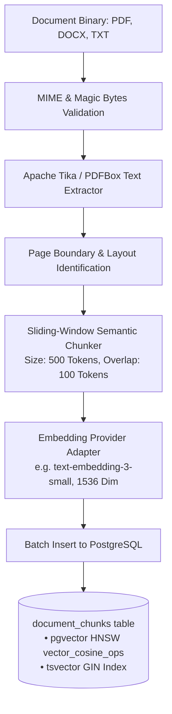
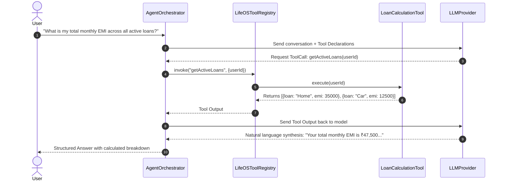

# LifeOS — Hybrid RAG & Agentic Intelligence Architecture

---

## 1. Overview & Anti-Hallucination Guarantees

LifeOS implements an enterprise-grade, grounded **Retrieval-Augmented Generation (RAG)** pipeline designed for zero data fabrication. 

### Core Grounding Principles:
1. **Source Grounding**: Every document-based answer includes explicit citations containing:
   - Document original filename
   - Exact physical page number
   - Chunk identifier and excerpt snippet
   - Cosine/RRF confidence score
2. **Deterministic Calculations**: Sums, balances, amortization calculations, and budget percentages are **never** calculated by the LLM prompt. They are executed by dedicated deterministic Java services via Agent Tool Calling.
3. **Low-Confidence Fallback**: When the fused retrieval score fails to exceed the confidence threshold ($Score_{min} = 0.68$), the system refuses to speculate and returns:
   > *"I could not find sufficient reliable information in your stored documents to answer this question."*

---

## 2. Ingestion & Preprocessing Pipeline



### Chunking Specification
* **Window Size**: 500 tokens (~1,800 characters)
* **Overlap**: 100 tokens (~350 characters)
* **Boundary Rules**: Chunks never cross major document section boundaries or physical page breaks unless a sentence spans across pages.
* **Attached Metadata**:
  ```json
  {
    "document_id": "4b92b6a2-...",
    "user_id": "e7c11f4d-...",
    "page_number": 3,
    "chunk_index": 7,
    "category": "INSURANCE",
    "filename": "Health_Optima_2026.pdf"
  }
  ```

---

## 3. Hybrid Search & Reciprocal Rank Fusion (RRF)

Dense vector search struggles with exact alphanumeric identifiers (e.g. policy number `POL-8842-X`, invoice `INV-2026-09`), while lexical keyword search struggles with conceptual queries (e.g. *"What are the critical illness exceptions?"*). LifeOS combines both using **Reciprocal Rank Fusion (RRF)**.

```mermaid
flowchart LR
    Query[User Natural Query] --> DensePath[Dense Path: pgvector Cosine]
    Query --> LexicalPath[Lexical Path: PostgreSQL tsvector BM25]

    DensePath --> TopDense[Top 20 Dense Chunks<br/>Ordered by vector <=> embedding]
    LexicalPath --> TopLexical[Top 20 Lexical Chunks<br/>Ordered by ts_rank_cd]

    TopDense --> RRF[Reciprocal Rank Fusion<br/>Score = 1/(60 + r_dense) + 1/(60 + r_lexical)]
    TopLexical --> RRF

    RRF --> FilterThreshold[Threshold Filter: Score >= 0.68]
    FilterThreshold --> TopK[Top 5 Reranked Chunks]
    TopK --> PromptContext[Context Window with Page Numbers]
```

### The RRF Formulation
For any document chunk $d$ appearing in dense ranking $r_{\text{dense}}(d)$ and lexical ranking $r_{\text{lexical}}(d)$:
$$\text{RRF\_Score}(d) = \frac{1}{k + r_{\text{dense}}(d)} + \frac{1}{k + r_{\text{lexical}}(d)}$$
Where smoothing constant $k = 60$.

### PostgreSQL Hybrid Query Implementation
```sql
WITH dense_search AS (
    SELECT id, document_id, content, page_number,
           ROW_NUMBER() OVER (ORDER BY embedding <=> :queryVector) as dense_rank
    FROM document_chunks
    WHERE user_id = :userId
    ORDER BY embedding <=> :queryVector
    LIMIT 20
),
lexical_search AS (
    SELECT id, document_id, content, page_number,
           ROW_NUMBER() OVER (ORDER BY ts_rank_cd(tsv_content, plainto_tsquery('english', :rawQuery)) DESC) as lexical_rank
    FROM document_chunks
    WHERE user_id = :userId AND tsv_content @@ plainto_tsquery('english', :rawQuery)
    LIMIT 20
)
SELECT 
    COALESCE(d.id, l.id) as chunk_id,
    COALESCE(d.document_id, l.document_id) as document_id,
    COALESCE(d.content, l.content) as content,
    COALESCE(d.page_number, l.page_number) as page_number,
    (COALESCE(1.0 / (60 + d.dense_rank), 0.0) + COALESCE(1.0 / (60 + l.lexical_rank), 0.0)) as rrf_score
FROM dense_search d
FULL OUTER JOIN lexical_search l ON d.id = l.id
ORDER BY rrf_score DESC
LIMIT 5;
```

---

## 4. Agentic AI & Tool-Calling Architecture

The assistant acts as an agent equipped with controlled Java tools:



### Safety & Confirmation Gates
Tools with side-effects (e.g. creating a reminder, recording a loan payment) declare `requiresConfirmation() = true`. The agent returns an interactive action card to the UI:
```json
{
  "actionRequired": "CONFIRMATION",
  "toolName": "recordLoanPayment",
  "parameters": {
    "loanId": "9b1deb4d-3b7d-4bad-9bdd-2b0d7b3dcb6d",
    "amount": 12500.00,
    "paymentDate": "2026-09-19"
  },
  "prompt": "Would you like me to record this payment of ₹12,500.00 against your Car Loan?"
}
```
Only when the user clicks **Confirm** in the frontend is the modifying service executed.
