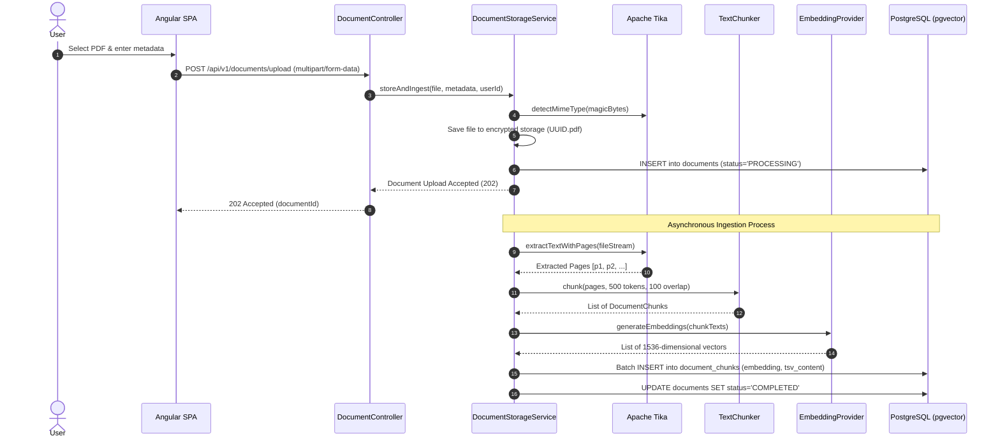

# LifeOS — API Flows & Interaction Sequences

---

## 1. Authentication & Token Refresh Flow

```mermaid
sequenceDiagram
    autonumber
    actor User
    participant App as Angular SPA
    participant Auth as AuthController
    participant Svc as AuthService
    participant DB as PostgreSQL

    User->>App: Enter email & password
    App->>Auth: POST /api/v1/auth/login
    Auth->>Svc: authenticate(email, password)
    Svc->>DB: Find user & verify BCrypt hash
    DB-->>Svc: UserEntity(role=ROLE_USER)
    Svc->>Svc: Generate Access JWT (15 min exp)
    Svc->>Svc: Generate Refresh Token (7 days exp)
    Svc->>DB: Save Refresh Token hash
    Svc-->>Auth: Tokens
    Auth-->>App: JSON Body: Access Token<br/>Set-Cookie: Refresh Token (HttpOnly, Secure)

    Note over App,Auth: 15 minutes elapse; Access Token expires

    App->>Auth: POST /api/v1/auth/refresh (Cookie: Refresh Token)
    Auth->>Svc: rotateRefreshToken(tokenFromCookie)
    Svc->>DB: Verify token hash & validate not revoked
    Svc->>DB: Revoke old token & store new token hash
    Svc->>Svc: Generate new Access JWT
    Svc-->>Auth: New Tokens
    Auth-->>App: JSON Body: New Access Token<br/>Set-Cookie: New Refresh Token
```

---

## 2. Multipart Document Ingestion Flow


