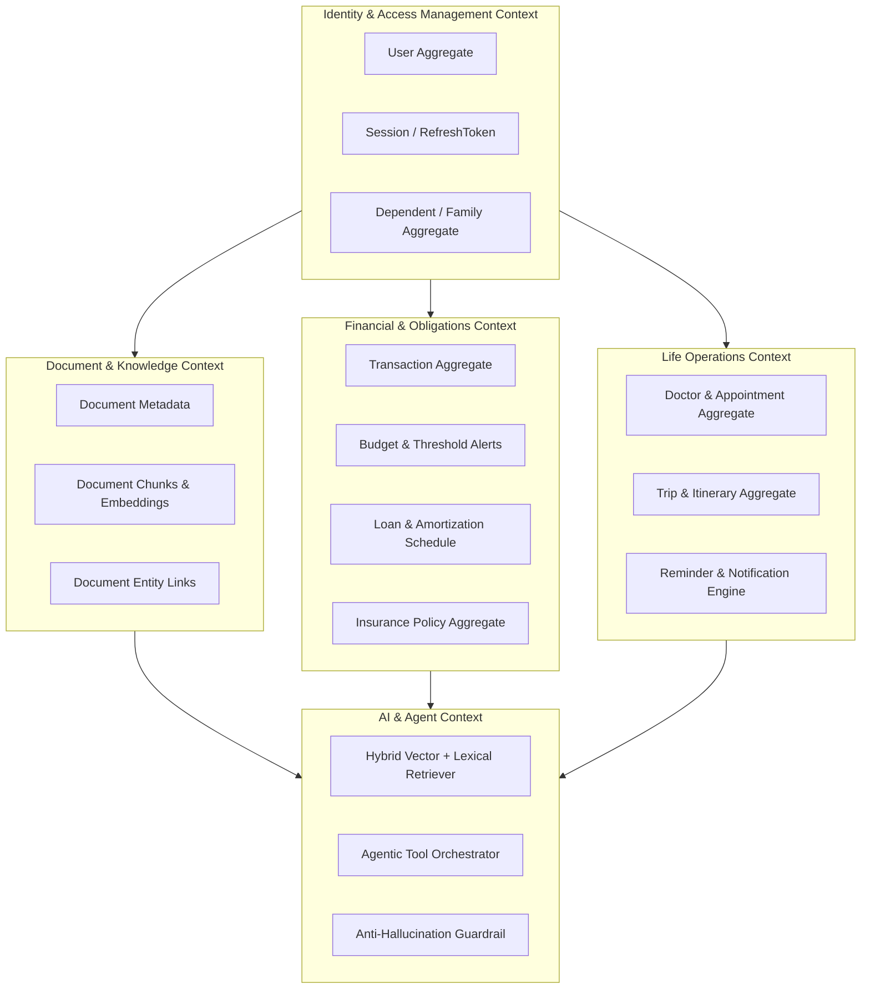

# LifeOS — Architecture Overview & Bounded Contexts

---

## 1. Domain-Driven Design (DDD) Bounded Contexts



---

## 2. Request Processing Pipeline

```mermaid
sequenceDiagram
    autonumber
    actor Client as Angular SPA
    participant GW as Spring Security Filter
    participant Ctrl as Domain Controller
    participant Svc as Domain Service
    participant Repo as JPA / JDBC Repo
    participant DB as PostgreSQL 16

    Client->>GW: HTTP POST /api/v1/... (Bearer JWT)
    GW->>GW: Validate JWT Signature & Expiration
    GW->>GW: Populate SecurityContext (UserPrincipal)
    GW->>Ctrl: Forward Request
    Ctrl->>Ctrl: Validate Payload (@Valid DTO)
    Ctrl->>Svc: Invoke Business Logic
    Svc->>Svc: Verify Resource Ownership (userId == principal.id)
    Svc->>Repo: Execute Query
    Repo->>DB: SQL Query with tenant filter
    DB-->>Repo: Result Set
    Repo-->>Svc: Domain Entities / Projections
    Svc->>>Ctrl: Return Response DTO
    Ctrl-->>Client: HTTP 200/201 (ApiResponse<T>)
```
