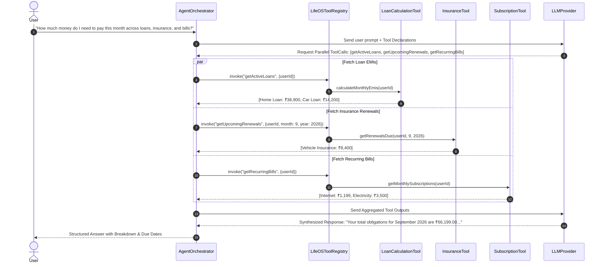
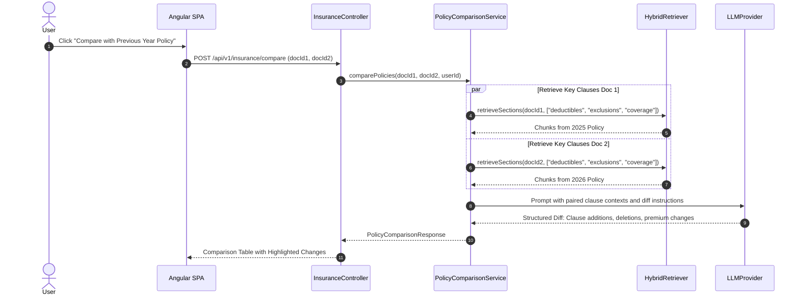

# LifeOS — Core Sequence Diagrams & Workflows

---

## 1. Multi-Domain Monthly Obligation Workflow

```mermaid
sequenceDiagram
    autonumber
    actor User
    participant Agent as AgentOrchestrator
    participant Registry as LifeOSToolRegistry
    participant LoanTool as LoanCalculationTool
    participant InsTool as InsuranceTool
    participant FinTool as SubscriptionTool
    participant LLM as LLMProvider

    User->>Agent: "How much money do I need to pay this month across loans, insurance, and bills?"
    Agent->>LLM: Send user prompt + Tool Declarations
    LLM-->>Agent: Request Parallel ToolCalls: [getActiveLoans, getUpcomingRenewals, getRecurringBills]
    
    par Fetch Loan EMIs
        Agent->>Registry: invoke("getActiveLoans", {userId})
        Registry->>LoanTool: calculateMonthlyEmis(userId)
        LoanTool-->>Agent: [Home Loan: ₹38,900, Car Loan: ₹14,200]
    and Fetch Insurance Renewals
        Agent->>Registry: invoke("getUpcomingRenewals", {userId, month: 9, year: 2026})
        Registry->>InsTool: getRenewalsDue(userId, 9, 2026)
        InsTool-->>Agent: [Vehicle Insurance: ₹8,400]
    and Fetch Recurring Bills
        Agent->>Registry: invoke("getRecurringBills", {userId})
        Registry->>FinTool: getMonthlySubscriptions(userId)
        FinTool-->>Agent: [Internet: ₹1,199, Electricity: ₹3,500]
    end

    Agent->>LLM: Send Aggregated Tool Outputs
    LLM-->>Agent: Synthesized Response: "Your total obligations for September 2026 are ₹66,199.00..."
    Agent-->>User: Structured Answer with Breakdown & Due Dates
```

---

## 2. Policy Document Comparison Workflow

```mermaid
sequenceDiagram
    autonumber
    actor User
    participant App as Angular SPA
    participant InsCtrl as InsuranceController
    participant CompareSvc as PolicyComparisonService
    participant Retriever as HybridRetriever
    participant LLM as LLMProvider

    User->>App: Click "Compare with Previous Year Policy"
    App->>InsCtrl: POST /api/v1/insurance/compare (docId1, docId2)
    InsCtrl->>CompareSvc: comparePolicies(docId1, docId2, userId)
    
    par Retrieve Key Clauses Doc 1
        CompareSvc->>Retriever: retrieveSections(docId1, ["deductibles", "exclusions", "coverage"])
        Retriever-->>CompareSvc: Chunks from 2025 Policy
    and Retrieve Key Clauses Doc 2
        CompareSvc->>Retriever: retrieveSections(docId2, ["deductibles", "exclusions", "coverage"])
        Retriever-->>CompareSvc: Chunks from 2026 Policy
    end

    CompareSvc->>LLM: Prompt with paired clause contexts and diff instructions
    LLM-->>CompareSvc: Structured Diff: Clause additions, deletions, premium changes
    CompareSvc-->>InsCtrl: PolicyComparisonResponse
    InsCtrl-->>App: Comparison Table with Highlighted Changes
```
